.. |logo| image:: ../../_static/img/TofuBox_out.png
            :width: 40
            :alt: TofuBox Logo

|logo| TofuBox - Technische Dokumentation
=========================================

.. meta::
   :description: Technische Dokumentation für das TofuBox HomeLab Projekt
   :keywords: Docker, MediaStack, Monitoring, ELK, Prometheus

:Projekt: TofuBox
:Team: Loris, Marc, Haiko
:Status: Abgeschlossen
:Datum: 05.01.2025

.. only:: html

    :download:`Download TofuBox - Technische Dokumentation <../../_static/pdf/tofu_box_technische_documentation.pdf>`

.. raw:: pdf

   PageBreak

.. important::
   **Zentrales Identitätsmanagement:**
   Sofern nicht anders angegeben, werden für alle Dienste folgende Standard-Zugangsdaten verwendet:

   * **Benutzername:** ``admin``
   * **Passwort:** ``sml12345``

Projektstruktur & Architektur
-----------------------------

Das Projekt ist in logische Stacks unterteilt, um die Wartung und Skalierbarkeit zu erhöhen.

.. code-block:: text

   vmadmin@li244-vmLM:~/workspace/homelab$
   .
   ├── collaboration/          # Team-Kommunikation (Mattermost)
   │   ├── config/             # Mattermost Konfigurationsdateien
   │   └── docker-compose.yml
   ├── media/                  # Der Media-Stack (Kernkomponente)
   │   ├── config/             # App-Configs (Jellyfin, Arrs)
   │   └── docker-compose.yaml
   ├── monitoring/             # Monitoring & Logging (ELK + Prometheus/Grafana)
   │   ├── docker-compose.yml
   │   ├── logstash/           # Log-Processing Pipeline
   │   └── prom/               # Prometheus Metrik-Konfiguration
   ├── pihole/                 # Netzwerk-Sicherheit & DNS-Filter
   │   └── docker-compose.yml
   └── README.md

Analyse der Schlüssel-Konfigurationen
^^^^^^^^^^^^^^^^^^^^^^^^^^^^^^^^^^^^^

Die folgenden Dateien sind entscheidend für die Funktionalität des Systems:

1. **monitoring/prom/prometheus.yml**:
   Definiert die Scraping-Intervalle und die Ziele (Targets). Ohne diese Konfiguration bleiben die Grafana-Dashboards leer.
2. **monitoring/logstash/pipeline/logstash.conf**:
   Das Herzstück der Log-Verarbeitung. Sie regelt den Empfang von Daten (Beats Port 5044) und die Weitergabe an Elasticsearch.
3. **media/.env**:
   Enthält die VPN-Zugangsdaten. Da der gesamte Media-Traffic über den VPN-Container (Gluetun) geroutet wird, ist diese Datei essenziell für Sicherheit und Anonymität.

.. raw:: pdf

   PageBreak

Anleitung: Media-Stack Setup
----------------------------

System-Voraussetzungen & Vorbereitung
^^^^^^^^^^^^^^^^^^^^^^^^^^^^^^^^^^^^^

Bevor Sie mit dem Deployment des Homelabs beginnen, muss das System vorbereitet und die Installation von Docker verifiziert werden.

1. Bereinigung der Umgebung (Cleanup)
"""""""""""""""""""""""""""""""""""""

Um eine "saubere" Installation zu gewährleisten und Konflikte mit alten Konfigurationen zu vermeiden, sollten alle bestehenden Docker-Ressourcen entfernt werden.

.. warning::
   Dieser Schritt löscht **alle** aktuell laufenden Container, Volumes und Netzwerke unwiderruflich.

.. code-block:: bash

   # Alle laufenden Container stoppen
   docker stop $(docker ps -aq)

   # Alle Container, Netzwerke, ungenutzten Images und Volumes entfernen
   docker system prune -a --volumes -f

2. System-Voraussetzungen prüfen
""""""""""""""""""""""""""""""""

Stellen Sie sicher, dass Docker und das Docker-Compose Plugin auf dem Host-System (Kali Linux VM) installiert sind und ordnungsgemäss funktionieren.

.. code-block:: bash

   # Überprüfung der installierten Docker Version
   docker --version

   # Überprüfung des Docker-Compose Plugins
   docker compose version

   # Überprüfung des Dienst-Status
   sudo systemctl status docker

3. Repository-Download
""""""""""""""""""""""

Klonen Sie das Projekt-Repository auf Ihren lokalen Server:

.. code-block:: bash

   git clone git@github.com:lorisleuenberger/homelab.git

4. Verzeichnis wechseln & Umgebungsvariablen erstellen
""""""""""""""""""""""""""""""""""""""""""""""""""""""
Navigieren Sie in den Media-Ordner, kopieren Sie das Template und erstellen Sie die produktive Konfigurationsdatei:

.. code-block:: bash

   cd homelab/media/
   cp .env.example .env

5. Konfiguration der .env Datei
"""""""""""""""""""""""""""""""
Öffnen Sie die Datei ``.env`` und tragen Sie Ihre Daten ein.

.. code-block:: text

   OPENVPN_USER=IhrUsername+pmp
   OPENVPN_PASSWORD=IhrPasswort
   MEDIA_FOLDER=/srv/media

.. important::
   * Fügen Sie am Ende des **OPENVPN_USER** zwingend das Suffix ``+pmp`` hinzu, um das Port-Forwarding zu ermöglichen.
   * Nutzen Sie als **MEDIA_FOLDER** den Pfad ``/srv/media``.

6. Erstellung der Speicherstruktur & Rechte
"""""""""""""""""""""""""""""""""""""""""""
Erstellen Sie das Basisverzeichnis inklusive der notwendigen Unterstrukturen für Downloads, Filme und Serien und setzen Sie die Berechtigungen rekursiv:

.. code-block:: bash

   # Verzeichnisstruktur erstellen
   sudo mkdir -p /srv/media/{downloads,movies,series}

   # Rechte rekursiv an den aktuellen User vergeben
   sudo chown -R $USER:$USER /srv/media
   sudo chmod -R 775 /srv/media

7. Deployment des Media-Stacks
""""""""""""""""""""""""""""""
Starten Sie die Container-Infrastruktur im Hintergrund:

.. code-block:: bash

   cd homelab/media
   sudo docker-compose up -d

8. Verifizierung der VPN-Verbindung
"""""""""""""""""""""""""""""""""""
Überprüfen Sie die Logs des **Gluetun**-Containers. Dieser dient als Gateway für alle anderen Dienste.

.. code-block:: bash

   sudo docker-compose logs -f gluetun

9. Übersicht der Media-Container
""""""""""""""""""""""""""""""""

+---------------+---------------+------------------------------------+-------------------------------------------------------------+
| Service       | Standard-Port | Zugriff (Browser/LAN)              | Funktion / Beschreibung                                     |
+===============+===============+====================================+=============================================================+
| Jellyfin      | 8096          | http://192.168.110.60:8096         | Medienserver: Filme, Serien, Musik streamen.                |
+---------------+---------------+------------------------------------+-------------------------------------------------------------+
| Sonarr        | 8989          | http://192.168.110.60:8989         | Serienverwaltung: Automatisches Herunterladen, Umbenennen   |
|               |               |                                    | und Sortieren von TV-Serien.                                |
+---------------+---------------+------------------------------------+-------------------------------------------------------------+
| Radarr        | 7878          | http://192.168.110.60:7878         | Filmverwaltung: Automatisches Herunterladen, Umbenennen     |
|               |               |                                    | und Sortieren von Filmen.                                   |
+---------------+---------------+------------------------------------+-------------------------------------------------------------+
| Prowlarr      | 9696          | http://192.168.110.60:9696         | Indexer-Manager: Verbindet Torrent/Usenet-Indexer mit       |
|               |               |                                    | Sonarr, Radarr, Lidarr, etc.                                |
+---------------+---------------+------------------------------------+-------------------------------------------------------------+
| qBittorrent   | 8080          | http://192.168.110.60:8080         | Torrent-Client: Lädt Torrents herunter, kann automatisiert  |
|               |               |                                    | von Sonarr/Radarr gesteuert werden.                         |
+---------------+---------------+------------------------------------+-------------------------------------------------------------+
| Gluetun       | Läuft im Hintergrund                               | VPN-Client + Firewall: Leitet Traffic der anderen Container |
|               |                                                    | über VPN, schützt IP und ermöglicht Port-Forwarding.        |
+---------------+---------------+------------------------------------+-------------------------------------------------------------+

10. qBittorrent WebUI Konfiguration
"""""""""""""""""""""""""""""""""""

Um Zugriff auf die Benutzeroberfläche zu erhalten, muss zunächst das automatisch generierte Passwort ausgelesen werden:

.. code-block:: bash

   sudo docker-compose logs qbittorrent | grep "WebUI administrator"

**Anschliessend sind folgende Schritte in der WebUI (Port 8080) zwingend erforderlich:**

1. **Passwort ändern:** Navigieren Sie zu *Tools -> Options -> WebUI* und setzen Sie das Passwort auf das Projekt-Standardpasswort ``sml12345``.
2. **Localhost-Bypass:** Aktivieren Sie in den gleichen Einstellungen die Option **"Bypass authentication for clients on localhost"**.

.. important::
   Dieser Bypass ist essenziell, damit **Gluetun** die Port-Forwarding-Regeln automatisch an qBittorrent übermitteln kann, ohne an der Authentifizierung zu scheitern.

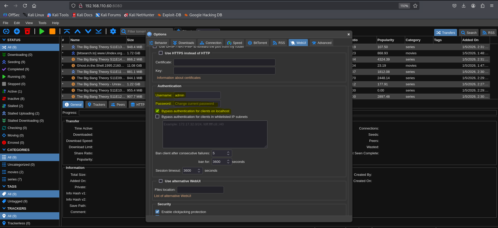

   Konfiguration der qBittorrent WebUI: Passwort-Anpassung und Aktivierung des Localhost-Bypass für die Gluetun-Integration.

.. raw:: pdf

   PageBreak

11. Konfiguration von Radarr & Sonarr (Download-Client)
"""""""""""""""""""""""""""""""""""""""""""""""""""""""

Damit Radarr und Sonarr wissen, wie sie Filme und Serien herunterladen sollen, muss qBittorrent als Download-Client verknüpft werden.

**Schritte für beide Applikationen:**

* Navigieren Sie zu **Settings -> Download Clients**.
* Klicken Sie auf das **"+" (Add)** und wählen Sie **qBittorrent**.
* Tragen Sie folgende Daten ein:

  * **Host:** ``192.168.110.60``
  * **Port:** ``8080``
  * **Username:** ``admin``
  * **Password:** ``sml12345``

* **Wichtig:** Deaktivieren Sie unter *Settings -> General* die Authentifizierung für lokale Adressen (**Authentication: External**).

.. list-table::
   :widths: 50 50
   :align: center

   * - .. figure:: ../../_static/img/tofubox/TofuBox_qBittorrent_RADARR_Konfiguration.PNG
          :alt: qBittorrent Konfiguration in Radarr
          :align: center
          :width: 100%

          **Konfiguration in Radarr:** Anbindung von qBittorrent als primärer Download-Client.

     - .. figure:: ../../_static/img/tofubox/TofuBox_qBittorrent_SONARR_Konfiguration.PNG
          :alt: qBittorrent Konfiguration in Sonarr
          :align: center
          :width: 100%

          **Konfiguration in Sonarr:** Anbindung von qBittorrent als primärer Download-Client.

.. note::
   Die obigen Screenshots zeigen die identische Konfiguration für beide Dienste. Achten Sie darauf, den Test-Button zu klicken, um die Verbindung zu verifizieren.

12. Optionale Konfiguration: Automatisierte Dateibenennung (Sonarr & Radarr)
""""""""""""""""""""""""""""""""""""""""""""""""""""""""""""""""""""""""""""

Um eine saubere und einheitliche Struktur in Ihrer Medienbibliothek zu gewährleisten, kann sowohl in Sonarr als auch in Radarr die automatisierte Umbenennung von Dateien aktiviert werden. Dies verhindert kryptische Dateinamen und erleichtert das Scannen durch Jellyfin.

**Konfigurationsschritte für beide Dienste:**
* Navigieren Sie zu **Settings -> Media Management**.
* Aktivieren Sie im Bereich **Episode Naming** (Sonarr) bzw. **Movie Naming** (Radarr) die Option **Rename**.
* Passen Sie bei Bedarf das Ordner-Format an (z.B. ``Season {season}`` oder ``{Movie Title} ({Release Year})``).
* Speichern Sie die Änderungen mit dem Button **Save Changes** oben links.

.. list-table::
   :widths: 50 50
   :align: center

   * - .. figure:: ../../_static/img/tofubox/TofuBox_SONARR_Media_Management.PNG
          :alt: Media Management in Sonarr
          :align: center
          :width: 100%

          **Konfiguration in Sonarr:** Aktivierung des Episode Namings für Serien.

     - .. figure:: ../../_static/img/tofubox/TofuBox_RADARR_Media_Management.PNG
          :alt: Media Management in Radarr
          :align: center
          :width: 100%

          **Konfiguration in Radarr:** Aktivierung des Movie Namings für Filme.

.. note::
   Durch diese Einstellung werden Dateien nach dem Download automatisch verschoben und umbenannt, sobald sie in das Verzeichnis ``/srv/media`` importiert werden.

13. Prowlarr: Indexer-Zentrale & API-Synchronisation
""""""""""""""""""""""""""""""""""""""""""""""""""""

Prowlarr dient als zentrale Verwaltung für Indexer. Damit die gefundenen Tracker automatisch an Radarr und Sonarr verteilt werden, müssen diese Apps über API-Keys mit Prowlarr verbunden werden.

**Schritt A: API-Key auslesen (Sonarr & Radarr)**
Zuerst muss der eindeutige Identifikationsschlüssel in beiden Ziel-Apps kopiert werden:

* Navigieren Sie in der jeweiligen WebUI zu **Settings -> General**.
* Suchen Sie den Abschnitt **Security**, in dem der **API Key** aufgeführt ist.
* Kopieren Sie den Schlüssel für die spätere Verwendung in Prowlarr.

.. list-table::
   :widths: 50 50
   :align: center

   * - .. figure:: ../../_static/img/tofubox/TofuBox_SONARR_API_Key.PNG
          :alt: API Key in Sonarr finden
          :align: center
          :width: 100%

          **API Key in Sonarr:** Zu finden unter Settings -> General.

     - .. figure:: ../../_static/img/tofubox/TofuBox_RADARR_API_Key.PNG
          :alt: API Key in Radarr finden
          :align: center
          :width: 100%

          **API Key in Radarr:** Zu finden unter Settings -> General.

**Schritt B: Applikationen in Prowlarr hinzufügen**
Wechseln Sie zur Prowlarr-Oberfläche (Port 9696), um die Verbindung herzustellen:

* Navigieren Sie zu **Settings -> Apps** und klicken Sie auf das **"+" (Add)**.
* Wählen Sie die entsprechende App (**Radarr** oder **Sonarr**) aus.
* Konfigurieren Sie die Verbindung im Detail-Fenster:
  * **Sync Level:** Stellen Sie diesen auf ``Full Sync``.
  * **Prowlarr Server:** Geben Sie die URL ``http://192.168.110.60:9696`` ein.
  * **App Server:** Geben Sie die URL der Ziel-App ein (``http://192.168.110.60:7878`` für Radarr bzw. ``8989`` für Sonarr).
  * **ApiKey:** Fügen Sie den zuvor kopierten Schlüssel der jeweiligen App ein.

.. list-table::
   :widths: 50 50
   :align: center

   * - .. figure:: ../../_static/img/tofubox/Prowlarr_Add_App_Radarr.PNG
          :alt: Hinzufügen von Radarr in Prowlarr
          :align: center
          :width: 100%

          **Verknüpfung Radarr:** Anbindung der Film-Datenbank.

     - .. figure:: ../../_static/img/tofubox/Prowlarr_Add_App_Sonarr.PNG
          :alt: Hinzufügen von Sonarr in Prowlarr
          :align: center
          :width: 100%

          **Verknüpfung Sonarr:** Anbindung der Serien-Datenbank.

.. important::
   Bevor Sie auf **Save** klicken, müssen Sie zwingend auf den **Test-Button** (Häkchen-Symbol) klicken. Erst wenn ein grünes Häkchen erscheint, ist die Kommunikation zwischen den Containern bestätigt.

**Schritt C: Überprüfung der erfolgreichen Synchronisation**
Nachdem beide Applikationen hinzugefügt wurden, sollten diese in der App-Übersicht von Prowlarr mit dem Status **Full Sync** erscheinen. Dies bestätigt, dass Prowlarr nun Indexer-Daten an beide Dienste pushen kann.

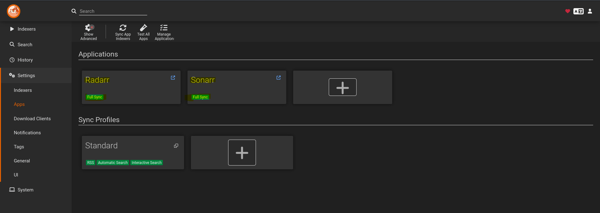

   **Erfolgskontrolle:** Beide Instanzen (Radarr & Sonarr) sind erfolgreich via API-Key grün synchronisiert.

**Schritt D: Authentifizierung anpassen**
Stellen Sie sicher, dass der Zugriff innerhalb des lokalen Netzwerks nicht blockiert wird.

* In den Prowlarr-Einstellungen unter **General** sollte die **Authentication** für lokale Adressen auf ``Disabled for Local Addresses`` gesetzt werden.

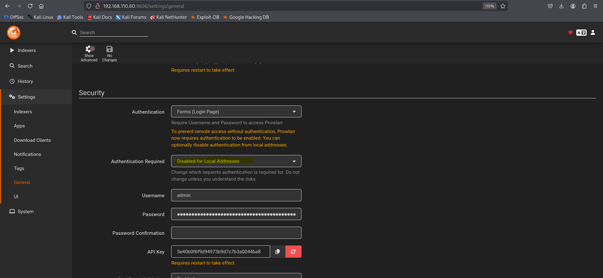

   **Sicherheit:** Konfiguration der Authentifizierungsmethode für den reibungslosen API-Zugriff.

.. raw:: pdf

   PageBreak

14. Indexer-Konfiguration in Prowlarr
"""""""""""""""""""""""""""""""""""""
Nachdem die Applikationen (Radarr/Sonarr) verbunden sind, müssen die eigentlichen Datenquellen – die Indexer – hinzugefügt werden. Prowlarr fungiert hier als Proxy, der die Suchanfragen an die verschiedenen Tracker weiterleitet.

**Übersicht der verwendeten Indexer:**

* **BitSearch:** Ein moderner, breit gefächerter Indexer mit einer riesigen Datenbank für alle Arten von Content.
* **EZTV:** Spezialisiert auf TV-Serien; die erste Wahl für automatisierte Serien-Downloads in Sonarr.
* **LimeTorrents:** Ein bewährter All-In-One Tracker, der für seine hohe Verifizierungsrate bekannt ist.
* **The Pirate Bay:** Einer der weltweit grössten und bekanntesten Indexer für Filme, Serien und Software.

**Schritt A: Einen Indexer hinzufügen (Beispiel EZTV)**
Der Vorgang ist für alle Indexer identisch. Hier am Beispiel von EZTV:

* Navigieren Sie zu **Indexers** und klicken Sie auf das **"+" (Add Indexer)**.
* Suchen Sie nach "EZTV" und wählen Sie den Eintrag aus.
* In der Regel können die Standardeinstellungen beibehalten werden.
* Klicken Sie auf den **Test-Button** (Häkchen), um die Erreichbarkeit zu prüfen, und dann auf **Save**.

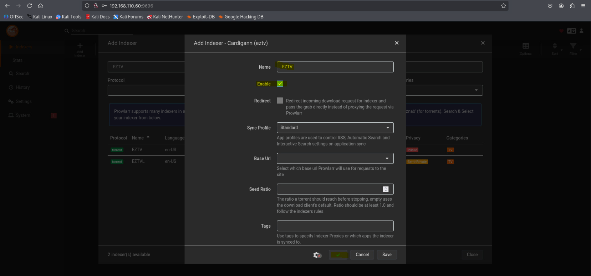

   **Konfiguration:** Beispielhafte Einrichtung des EZTV-Indexers. Alle weiteren Indexer folgen exakt diesem Schema.

**Schritt B: Übersicht der aktiven Indexer**
Nachdem Sie BitSearch, EZTV, LimeTorrents und The Pirate Bay hinzugefügt haben, sollten alle Tracker in der Hauptübersicht mit einem grünen Status-Symbol erscheinen.

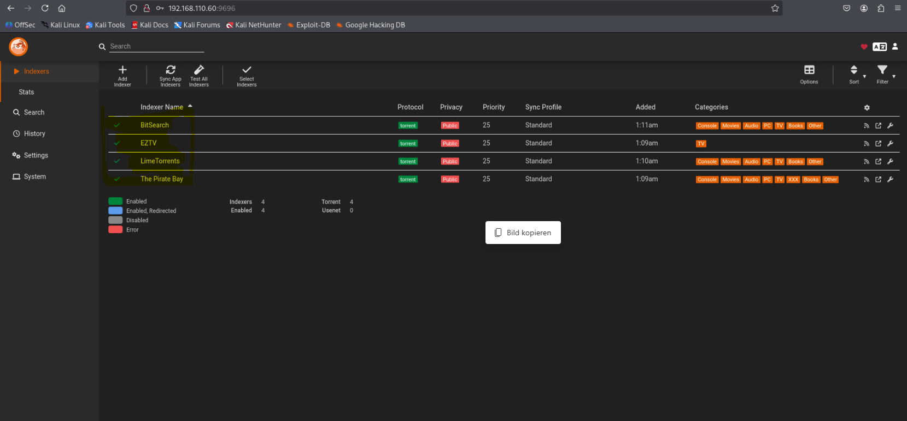

   **Erfolgskontrolle:** Alle konfigurierten Indexer sind aktiv und bereit für die Synchronisation mit Radarr und Sonarr.

.. note::
   Dank der in Schritt 13 eingerichteten "Full Sync" Verbindung werden diese Indexer nun automatisch und ohne weiteres Zutun in Radarr und Sonarr unter *Settings -> Indexers* eingetragen.

15. Erster Funktions-Test: Validierung der Automatisierung
""""""""""""""""""""""""""""""""""""""""""""""""""""""""""

Nach Abschluss der Konfiguration wird die gesamte Kette – von der Suche über den Download via VPN bis zum Import – validiert. Hierfür nutzen wir die Filmverwaltung (**Radarr**).

**Schritt A: Hinzufügen von Test-Medien**
Suchen Sie in der Radarr-WebUI nach Test-Titeln (z. B. Klassiker oder aktuelle Produktionen), um den Prozess anzustossen.

* Klicken Sie auf **Movies -> Add New**.
* Suchen Sie nach einem gewünschten Medium (Beispiel 1: Ein Cyberpunk-Klassiker).
* Stellen Sie sicher, dass der **Root Folder** auf ``/movies`` zeigt.
* Klicken Sie auf **Add Movie**. Wiederholen Sie dies für ein zweites Beispiel (Beispiel 2: Ein bekannter Science-Fiction Film).

.. list-table::
   :widths: 50 50
   :align: center

   * - .. figure:: ../../_static/img/tofubox/Radarr_Test_Download_Film1.PNG
          :alt: Hinzufügen von Film 1 in Radarr
          :align: center
          :width: 100%

          **Testlauf 1:** Initiierung des Suchvorgangs für das erste Test-Medium.

     - .. figure:: ../../_static/img/tofubox/Radarr_Test_Download_Film2.PNG
          :alt: Hinzufügen von Film 2 in Radarr
          :align: center
          :width: 100%

          **Testlauf 2:** Validierung der Warteschlange durch ein zweites Medium.

**Schritt B: Überwachung der Download-Aktivität**
Wechseln Sie in den Bereich **Activity**, um den Status der Downloads in Echtzeit zu verfolgen. Hier wird ersichtlich, ob die Kommunikation mit dem Download-Client (qBittorrent) über den VPN-Tunnel erfolgreich ist.

* In der Übersicht erscheinen beide Titel mit ihrem aktuellen Fortschritt.
* Sobald der Download abgeschlossen ist, verschiebt Radarr die Dateien automatisch vom Download-Ordner in den finalen Medien-Ordner (``/srv/media/movies``) und benennt sie nach definierten Schema um.

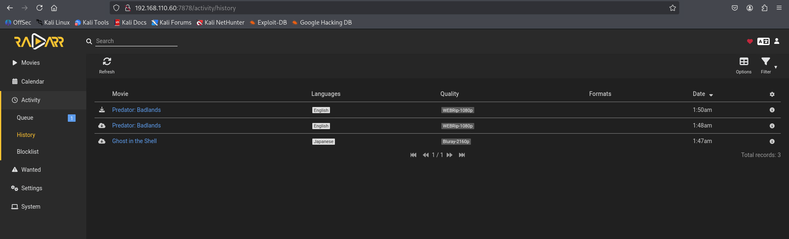

   **Erfolgskontrolle:** Die Activity-Ansicht bestätigt den parallelen Download beider Medien über die gesicherte Verbindung.

.. note::
   **Rechtlicher Hinweis:** Dieser Test dient ausschliesslich der technischen Validierung der Infrastruktur unter Verwendung von Beispieldaten. Der Betreiber ist selbst für die Einhaltung der geltenden Urheberrechtsbestimmungen verantwortlich.

.. raw:: pdf

   PageBreak

16. Jellyfin: Mediatheken & TofuBox Branding
""""""""""""""""""""""""""""""""""""""""""""

Nachdem die Test-Downloads abgeschlossen sind, werden diese in der Streaming-Zentrale (Jellyfin) verfügbar gemacht und das System optisch an das Projektdesign angepasst.

**Schritt A: Mediatheken für Filme und Serien einrichten**
Loggen Sie sich in Jellyfin ein (Standard: ``admin`` / ``sml12345``) und navigieren Sie zu **Dashboard -> Bibliotheken**:

* Erstellen Sie eine Mediathek für **Filme** mit dem Pfad ``/data/movies``.
* Erstellen Sie eine zweite Mediathek für **Serien** mit dem Pfad ``/data/series``.

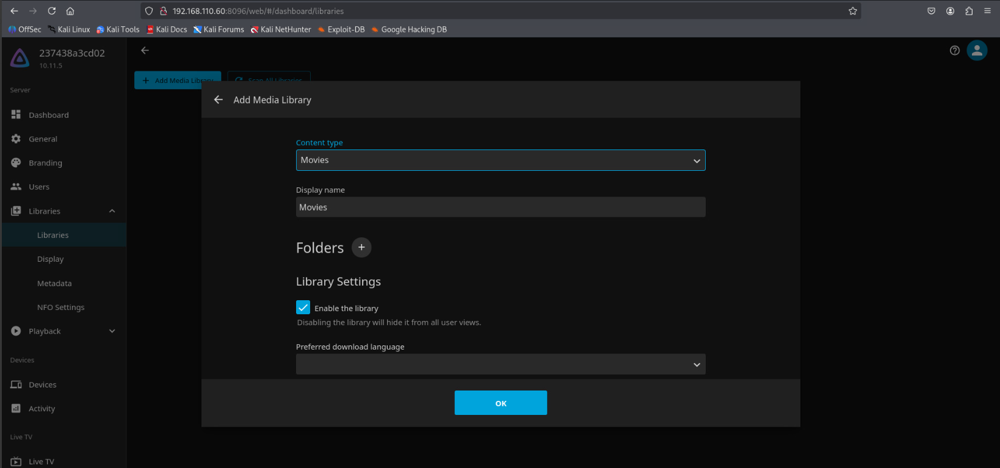

   **Bibliotheks-Setup:** Einbindung des Verzeichnisses für Spielfilme.

**Schritt B: TofuBox Logo & Branding**
Das offizielle Projekt-Logo kann unter folgendem Link heruntergeladen werden:

:download:`Download TofuBox Logo <../../_static/img/resized_16x9_image_TofuBox_out.png>`

* Navigieren Sie zu **Dashboard -> Branding**.
* Laden Sie das Logo hoch und aktivieren Sie die Option **Enable the splash screen image**.

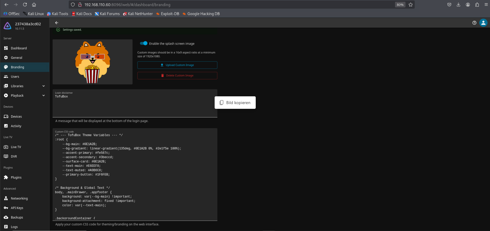

   **Visual Identity:** Hochladen des Custom-Logos und Aktivierung des Splash-Screens.

**Schritt C: Custom CSS Design**
Hinterlegen Sie den folgenden Code unter **Dashboard -> Allgemein -> Benutzerdefinierter CSS-Code**, um das TofuBox-Farbschema zu aktivieren:

.. code-block:: css

   /* --- TofuBox Theme Variables --- */
   :root {
       --bg-main: #0E1A2B;
       --bg-gradient: linear-gradient(135deg, #0E1A2B 0%, #2e1f5e 100%);
       --accent-primary: #fe587c;
       --accent-secondary: #3beccd;
       --surface-card: #0E1A2B;
       --text-main: #E6EEF8;
       --text-muted: #A9B6C8;
       --primary-button: #1F6FEB;
   }

   /* --- LOGO & BRANDING FIXES --- */
   .pageTitleWithLogo {
       background-image: inherit !important;
       filter: drop-shadow(0 0 5px rgba(254, 88, 124, 0.3));
   }

   .pageTitleWithDefaultLogo {
       background-image: none !important;
   }

   .pageTitleWithDefaultLogo::before {
       content: 'Tofu';
       font-weight: 800;
       font-size: 24px;
       color: var(--text-main);
   }

   .pageTitleWithDefaultLogo::after {
       content: 'Box';
       font-weight: 800;
       font-size: 24px;
       color: var(--accent-primary);
       background: rgba(254, 88, 124, 0.1);
       padding: 2px 6px;
       border-radius: 4px;
       margin-left: 2px;
   }

   /* --- BACKGROUND & GLOBAL --- */
   body, .mainDrawer, .appfooter {
       background: var(--bg-main) !important;
       color: var(--text-main);
   }

   .backgroundContainer {
       background-color: var(--bg-main) !important;
       background-image: var(--bg-gradient) !important;
   }

   /* --- CARDS & HOVER EFFECTS --- */
   .cardInner {
       background-color: var(--surface-card) !important;
       border-radius: 12px;
       transition: transform 0.2s ease, box-shadow 0.2s ease;
   }

   .card:hover .cardInner {
       transform: scale(1.03);
       box-shadow: 0 8px 20px rgba(0,0,0,0.5);
       border: 1px solid var(--accent-primary);
   }

**Schritt D: Abschlusskontrolle**
Nach dem Speichern erstrahlt die TofuBox-Oberfläche im neuen Design. Alle importierten Filme und Serien werden nun übersichtlich mit Covern und Metadaten angezeigt.

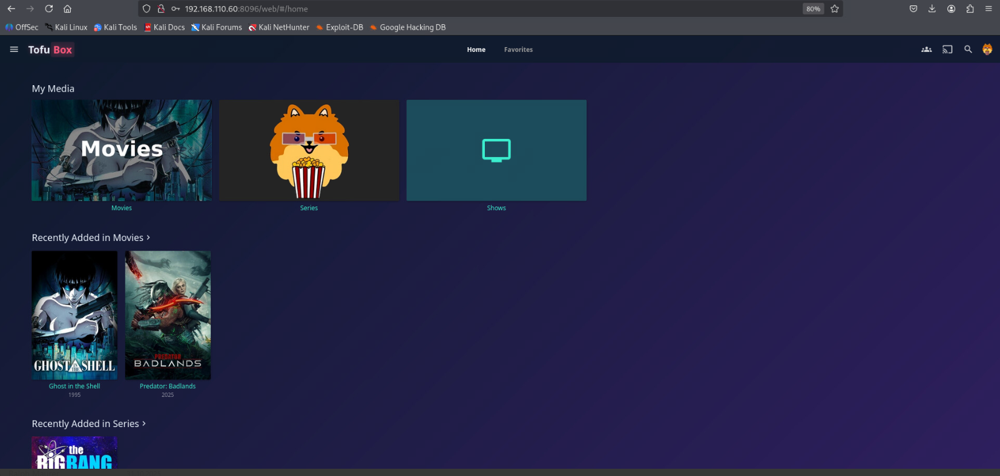

   **Resultat:** Die fertig konfigurierte TofuBox-Mediathek mit aktivem Branding und geladenen Inhalten.

.. raw:: pdf

   PageBreak

Anleitung: Monitoring & Logging
-------------------------------

1. Start des Monitoring-Stacks
^^^^^^^^^^^^^^^^^^^^^^^^^^^^^^

Navigieren Sie in den entsprechenden Ordner und starten Sie die Dienste:

.. code-block:: bash

   cd ~/workspace/homelab/monitoring
   sudo docker-compose up -d

2. Übersicht der Monitoring-Dienste
^^^^^^^^^^^^^^^^^^^^^^^^^^^^^^^^^^^

+-----------------+---------------+-----------------------------+---------------------------------------------------------------+
| Service         | Standard-Port | Zugriff (Browser/LAN)       | Funktion / Beschreibung                                       |
+=================+===============+=============================+===============================================================+
| Grafana         | 3000          | http://192.168.110.60:3000  | Visualisierung der Metriken von Prometheus.                   |
+-----------------+---------------+-----------------------------+---------------------------------------------------------------+
| Kibana          | 5601          | http://192.168.110.60:5601  | Log-Analyse Oberfläche (ELK-Stack).                           |
+-----------------+---------------+-----------------------------+---------------------------------------------------------------+
| Prometheus      | 9090          | http://192.168.110.60:9090  | Zeitreihen-Datenbank für Metriken.                            |
+-----------------+---------------+-----------------------------+---------------------------------------------------------------+

3. Validierung der Prometheus-Targets
^^^^^^^^^^^^^^^^^^^^^^^^^^^^^^^^^^^^^

Bevor Dashboards erstellt werden können, muss sichergestellt sein, dass die Datenquellen (Targets) aktiv sind. Prüfen Sie unter http://192.168.110.60:9090 im Menü **Status -> Targets**, ob die Endpunkte auf **UP** stehen.

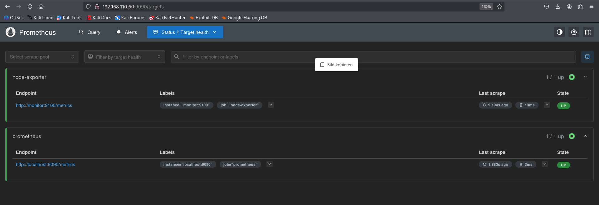

   Monitoring Testing - Die Endpunkte node-exporter und prometheus sind erfolgreich verbunden (Status UP).

4. Grafana Konfiguration & Dashboard Import
^^^^^^^^^^^^^^^^^^^^^^^^^^^^^^^^^^^^^^^^^^^

**Schritt A: Prometheus als Datenquelle hinzufügen**
Damit Grafana Daten anzeigen kann, muss Prometheus als "Data Source" registriert werden.

.. list-table::
   :widths: 50 50
   :align: center

   * - .. figure:: ../../_static/img/tofubox/Grafana_Add_DataSource.PNG
          :alt: Grafana Data Source hinzufügen
          :align: center
          :width: 100%

          Auswahl "Add data source" in den Grafana Connections.

     - .. figure:: ../../_static/img/tofubox/Grafana_Prometheus_Config.PNG
          :alt: Prometheus Konfiguration
          :align: center
          :width: 100%

          Konfiguration der URL (http://prometheus:9090) und erfolgreicher Save-Test.

**Schritt B: Dashboard erstellen und importieren**
Wir nutzen das "Node Exporter Full" Dashboard, um alle Hardware-Metriken auf einen Blick zu sehen.

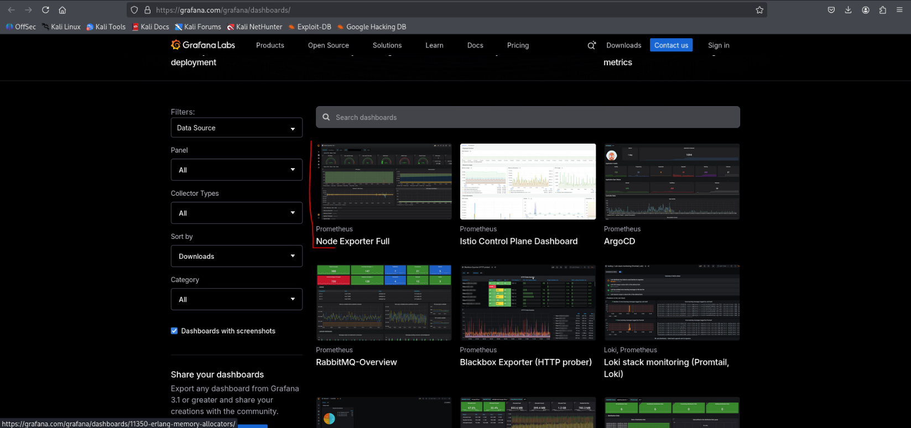

   Navigieren zum Dashboard-Erstellungs-Menü.

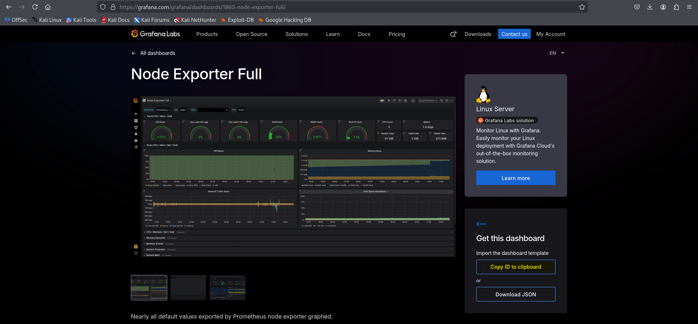

   Suche auf Grafana Labs. Hier muss die Clipboard ID (1860) kopiert werden.

**Schritt C: Importvorgang und Resultat**
Geben Sie die ID im Import-Fenster ein, um das Template zu laden.

.. list-table::
   :widths: 50 50
   :align: center

   * - .. figure:: ../../_static/img/tofubox/Importieren_des_Dashboards_ID.PNG
          :alt: Import via ID
          :align: center
          :width: 100%

          Importieren des Dashboards durch Laden der ID 1860.

     - .. figure:: ../../_static/img/tofubox/Finales_Monitoring_Resultat.PNG
          :alt: Finales Monitoring Resultat
          :align: center
          :width: 100%

          Das fertige Resultat zeigt CPU, RAM und Disk-Usage in Echtzeit.