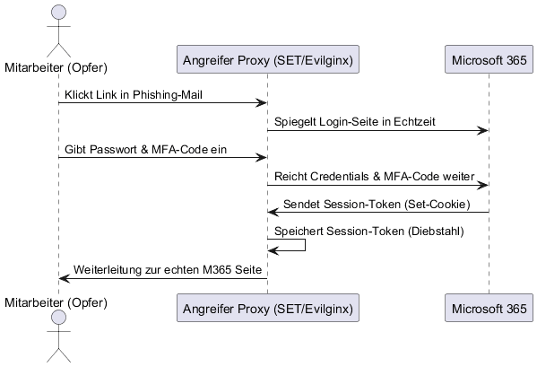
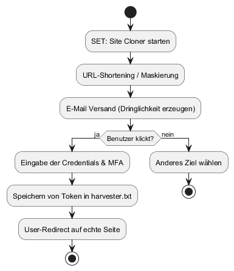

========================================================================================================================
MODUL CYS: FALLSTUDIE SOCIAL ENGINEERING
========================================================================================================================

.. role:: highlight
.. role:: alert

.. meta::
   :author: Haiko Nuding
   :class: 25b
   :date: F2026

************************************************************************************************************************
Dokumenten-Informationen & Zielprofil
************************************************************************************************************************

:Author: Haiko Nuding
:Klasse: 25b
:Datum: 28.02.2026

**Target-Profil: Die betroffene Organisation**
==============================================

.. list-table:: Unternehmenssteckbrief: AlpenTech AG
   :widths: 30 70
   :header-rows: 1
   :class: table

   * - Eigenschaft
     - Details
   * - **Unternehmensform**
     - Mittelständisches Unternehmen (KMU)
   * - **Mitarbeitende**
     - 180 (Hybrid-Arbeitsmodell)
   * - **IT-Infrastruktur**
     - Cloud-fokussiert (Microsoft 365)
   * - **Security-Status**
     - MFA aktiv (SMS & App), externer IT-Dienstleister
   * - **Schwachpunkt**
     - Fehlende interne Security-Instanz (kein CISO)
   * - **Vorfallswert**
     - :alert:`Finanzieller Schaden von CHF 87’000` (Direct Business Email Compromise)

.. raw:: pdf

   PageBreak

.. contents:: Inhaltsverzeichnis
   :depth: 2

.. raw:: pdf

   PageBreak

************************************************************************************************************************
1. Rahmenbedingungen & Ausgangslage
************************************************************************************************************************

1.1 Rolle des Studierenden
==========================

In dieser Fallstudie agiere ich in einer Doppelrolle: Zunächst als **analytischer Angreifer** zur Identifikation der
Vulnerabilitäten und anschliessend als **CISO/Verteidiger** zur Evaluation technischer und organisatorischer Resilienzmassnahmen.

1.2 Ziel der Fallstudie
=======================

Untersuchung der kritischen Schnittstelle zwischen menschlicher Entscheidung und technischer Absicherung. Ziel ist die
Rekonstruktion eines Identitätsdiebstahls, der trotz aktiver MFA ohne den Einsatz klassischer Malware erfolgreich war.

1.3 Ausgangslage: Der Vorfall
=============================

Trotz aktiver MFA wurde eine Zahlung von :highlight:`CHF 87’000` manipuliert. Da keine Malware gefunden wurde, liegt
der Fokus auf der technischen Umgehung der MFA durch Täuschung der menschlichen Komponente (**Spear Phishing** in
Kombination mit **AiTM**) [#ms_aitm]_.

.. raw:: pdf

   PageBreak

************************************************************************************************************************
2. Teil 1: Angriffsanalyse
************************************************************************************************************************

2.1 Frage 1: Angriffstyp bestimmen
==================================

Aufgrund der Faktenlage ist ein **Spear Phishing** Angriff unter Einsatz von **Adversary-in-the-Middle (AiTM)** am
wahrscheinlichsten.

* **Warum Spear Phishing?**: Der Angriff war hochgradig personalisiert (Zahlungsprozess der Buchhaltung). Ein breites
  Phishing hätte nicht gezielt eine Zahlung von CHF 87'000 auslösen können.
* **Warum AiTM?**: Da MFA aktiv war, reicht das Abgreifen von Passwörtern nicht aus. Der Angreifer muss das
  Session-Token (Cookie) stehlen, um die MFA-Hürde zu umgehen.
* **Wahrscheinlichkeit**: Diese Kombination erklärt den "erfolgreichen Login" trotz MFA ohne Malware-Installation auf
  dem Endgerät.
* **Gegenbeweis**: Da keine Malware gefunden wurde, scheiden Keylogger oder RATs aus. Die Anmeldewarnungen bestätigen,
  dass der Zugriff über einen Proxy des Angreifers erfolgte.

2.2 Frage 2: Angriffslogik rekonstruieren
=========================================

   **Abb. 1:** Schematische Darstellung eines Spear-Phishing-Angriffs mit AiTM zur Session-Übernahme.

Die Rekonstruktion umfasst 6 Schritte (Fokus auf die Nutzung legitimer Prozesse):

1. **Recherche**: Gezielte Identifikation von Buchhaltungsmitarbeitern via LinkedIn/Xing (Spear Phishing Vorbereitung).
2. **Köder**: Personalisierte E-Mail mit dem Vorwand einer "Sicherheitsüberprüfung". Dies erzeugt **Entscheidungsdruck**,
   da der Mitarbeiter eine Kontosperrung befürchtet.
3. **Phishing**: Login auf einer Proxy-Seite. Der Angreifer spiegelt die echte M365-Seite und fängt Zugangsdaten sowie
   das validierte Session-Token ab.
4. **Persistenz**: Der Angreifer nutzt das Token, um Zugriff auf Outlook zu erhalten. Er erstellt Regeln, um E-Mails
   der Geschäftsleitung unbemerkt umzuleiten.
5. **Manipulation**: Der Angreifer wartet den **legitimen Prozess** einer anstehenden Zahlung ab. Er fängt eine echte
   Rechnung ab und modifiziert lediglich die Zahlungsdaten (IBAN).
6. **Finanzbetrug**: Die manipulierte Rechnung wird vom echten Konto des Mitarbeiters versendet. Da Absender und Betreff
   korrekt sind, schöpft die ausführende Stelle keinen Verdacht.

************************************************************************************************************************
3. Teil 2: Anwendung mit SET (Kali Linux)
************************************************************************************************************************

3.1 Frage 3: Auswahl des SET-Angriffsvektors
============================================

Für die Simulation wird der Pfad **Website Attack Vectors -> Credential Harvester -> Site Cloner** gewählt.

* **Abgrenzung**: Andere Vektoren wie "Infectious Media" oder "Spear-Phishing Payload" würden Malware hinterlassen,
  was im Vorfall explizit ausgeschlossen wurde.
* **Realismus**: Nur der Site Cloner ermöglicht es, die vertraute Microsoft-Umgebung für den Benutzer perfekt
  nachzubilden, was für ein glaubwürdiges Spear Phishing essenziell ist.

3.2 Frage 4: Simulation statt Ausführung
========================================

   **Abb. 2:** Prozesslogik der Simulation im Social Engineering Toolkit.

Die Logik basiert auf drei psychologischen Triggern:

* **Autorität**: Das Klonen der offiziellen Microsoft-CI suggeriert Sicherheit.
* **Knappheit & Druck**: Die Mail droht mit Kontosperrung. Im **Hybrid-Modell** fehlt der kurze Dienstweg zum Kollegen,
  was die Isolation und den Stress erhöht.
* **Technik**: SET automatisiert das Harvesting der Daten in der Datei ``harvester.txt``.

3.3 Frage 5: Warum MFA nicht schützt
====================================

* **Session Hijacking**: MFA schützt das "Schloss" beim Eintritt. Der Angreifer stiehlt jedoch den "Passierschein"
  (Session Cookie), der nach dem Login ausgestellt wird [#session_theft]_.
* **Menschliches Verhalten**: :highlight:`MFA-Fatigue` führt zu reflexartiger Bestätigung ohne Kontextprüfung. Bekannte
  Vorfälle zeigen, dass Nutzer bei wiederholten Anfragen den Widerstand aufgeben [#uber_hack]_.

************************************************************************************************************************
4. Teil 3: Kritische Reflexion
************************************************************************************************************************

4.1 Frage 6: Menschliches Verhalten
===================================

Der betroffene Mitarbeitende handelte unter dem Einfluss des **Authority Bias** (vermeintliche IT-Anweisung).
Technisch wurde die MFA zwar korrekt bedient, doch die Kontextprüfung ("Warum jetzt? Warum über diesen Link?")
unterblieb. Ein sicheres Verhalten hätte den Abbruch und den manuellen Aufruf des Portals über den Browser erfordert.

4.2 Frage 7: Organisationelle Verantwortung
===========================================

Die AlpenTech AG hat das Prinzip der **Defense-in-Depth** vernachlässigt. Es fehlten:
1. **Technische Barrieren**: Fehlende Einschränkung des Zugriffs auf bekannte Unternehmens-IPs oder verwaltete Geräte.
2. **Prozessuale Mängel**: Fehlendes medienbruchfreies Vier-Augen-Prinzip (z. B. telefonische Verifikation) bei der Änderung von Zahlungsstammdaten.

.. raw:: pdf

   PageBreak

************************************************************************************************************************
5. Teil 4: Defense (CISO-Denken)
************************************************************************************************************************

5.1 Frage 8: Gegenmassnahmen priorisieren
=========================================

.. list-table:: Strategischer Massnahmenplan
   :header-rows: 1
   :widths: 20 50 30
   :class: table

   * - Priorität
     - Massnahme
     - Kategorie
   * - **Sofort**
     - 4-Augen-Prinzip & Telefon-Validierung
     - Organisatorisch
   * - **Hoch**
     - Umstellung auf FIDO2 Hardware-Tokens [#fido_logic]_
     - Technisch
   * - **Mittel**
     - Conditional Access & IP-Whitelisting
     - Technisch
   * - **Begleitend**
     - Gezielte Spear-Phishing-Simulationen mit SET
     - Menschlich

Details zu den Kernmassnahmen:
-----------------------------

**Technisch:**

* **FIDO2 Tokens**: Hardware-Keys sind "Origin Bound" [#fido_logic]_. Das bedeutet, sie senden den Code nur an die
  echte Domäne, niemals an die Proxy-URL des Angreifers.
* **Conditional Access**: Richtlinien, die den Zugriff auf "Managed Devices" einschränken. Ein Angreifer mit einem
  gestohlenen Token scheitert, da sein Gerät nicht im Firmen-Inventar ist.

**Organisatorisch:**

* **Prozesshärtung**: Jede Änderung einer Kreditoren-IBAN muss telefonisch über eine bekannte Nummer verifiziert werden.

5.2 Frage 9: SET als Verteidigungswerkzeug
==========================================

SET ist für Security-Verantwortliche ein essenzielles Werkzeug für "Reality Checks". Es verdeutlicht, dass rein
technische Hürden durch geschickte psychologische Führung umgangen werden können.

Das Tool ermöglicht praxisnahe Simulationen zur gezielten Sensibilisierung. Ethisch ist hierbei eine
**No-Blame-Culture** zwingend: Die Simulationen dienen der **individuellen Kompetenzentwicklung** und der Stärkung
der organisationalen Resilienz, nicht der Überwachung oder Sanktionierung von Mitarbeitenden.

.. raw:: pdf

   PageBreak

************************************************************************************************************************
6. Teil 5: Transfer & Glossar
************************************************************************************************************************

6.1 Frage 10: Übertrag (Technologie-Check)
==========================================

* **Zero Trust**: Vertraut niemandem, auch nicht innerhalb des Netzes. Jede Transaktion wird neu bewertet.
* **Passwordless**: Ohne Passwort hat der Angreifer kein Primär-Geheimnis mehr, das er fischen kann.

6.2 Glossar der Fachbegriffe
============================

* **Spear Phishing**: Ein gezielter Phishing-Angriff auf eine spezifische Person oder Gruppe.
* **AiTM (Adversary-in-the-Middle)**: Ein Angriff, bei dem der Angreifer Datenströme in Echtzeit abfängt.
* **FIDO2**: Ein offener Standard für die passwortlose Authentifizierung mittels Kryptografie.
* **MFA-Fatigue**: Psychologische Ermüdung durch zu viele Sicherheitsabfragen.

6.3 Fazit
=========

Der Vorfall der AlpenTech AG unterstreicht: :alert:`Technik allein ist kein Allheilmittel.` Wahre Cyber-Resilienz
entsteht erst durch die Symbiose aus phishing-resistenter Hardware, prozessualen Kontrollmechanismen und einer
wachsamen Unternehmenskultur.

**Quellenverzeichnis & Referenzen**
===================================
.. [#ms_aitm] Microsoft Security: *From cookie theft to BEC: Attackers use AiTM phishing to bypass MFA.*
.. [#session_theft] NCSC: *Session Hijacking und Schutzmassnahmen in Cloud-Umgebungen.*
.. [#uber_hack] TechCrunch: *Uber hack report – How MFA Fatigue was used to breach internal systems.*
.. [#fido_logic] FIDO Alliance: *How FIDO2 provides phishing-resistant authentication.*