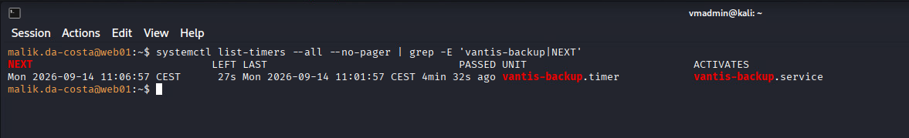
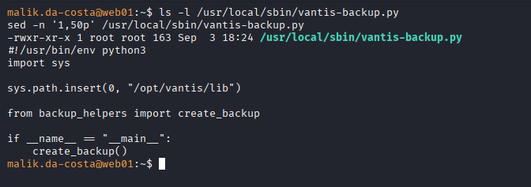
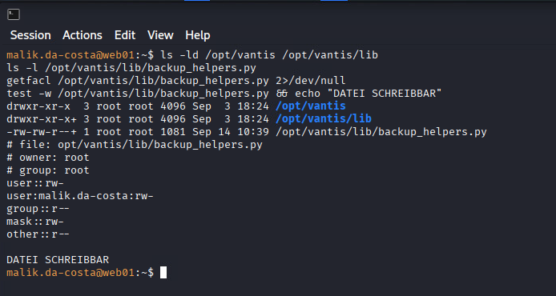
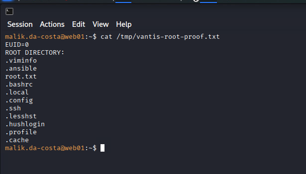
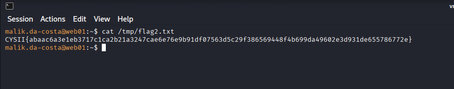
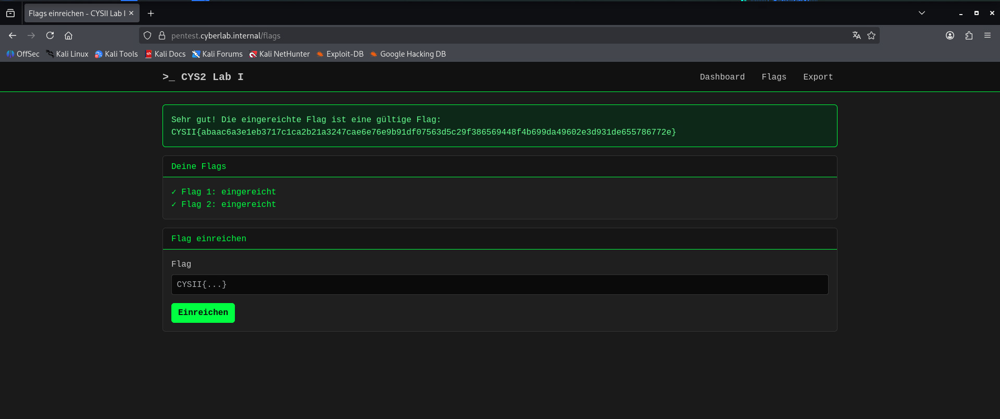

==================================================
LABI Abgabe Report – Vantis Group Penetration Test
==================================================

:Projekt: CYS II – LABI Abgabe Report
:Auftraggeber: Vantis Group
:Autor: Haiko Nuding
:Klasse: H25b
:Assessment-Zeitraum: 31.08.2026, 17:30:00 bis 20.09.2026, 23:59:59
:Report-Datum: 18.09.2026
:Status: Finaler Report
:In Scope: ``10.47.64.0/18``
:Out of Scope: ``10.145.37.0/24``
:Primäres Zielsystem: ``web01.vantis.internal`` / ``10.47.84.110``

.. note::

   **Vertraulichkeit**

   Dieser Bericht enthält sicherheitsrelevante technische Informationen,
   Credentials, Angriffspfade und Evidence aus einer autorisierten
   Lab-Umgebung. Die Inhalte sind ausschliesslich für die vorgesehene
   Abgabe bestimmt und dürfen nicht an andere Studierende weitergegeben
   werden.

.. raw:: pdf

   PageBreak

Inhaltsverzeichnis
==================

.. contents::
   :local:
   :depth: 3
   :backlinks: top

1. Executive Summary
====================

Im Rahmen des autorisierten Penetration Tests wurde die im Scope liegende
Vantis-Infrastruktur aus der Perspektive eines Angreifers mit bestehender
Netzwerkverbindung zum Zielsegment untersucht.

Das Assessment zeigte eine **kritische Gesamtrisikolage** für den zentralen
Zielhost ``web01.vantis.internal``. Mehrere miteinander verkettete
Fehlkonfigurationen ermöglichten zunächst den Zugriff auf interne Anwendungen
und anschliessend die Übernahme eines regulären Benutzerkontos. Aus diesem
Benutzerkontext konnte die lokale Privilegiengrenze vollständig überwunden
und die Kontrolle über das betroffene System bis zur höchsten lokalen
Berechtigungsstufe erweitert werden.

Die wesentliche geschäftliche Auswirkung besteht darin, dass ein Angreifer mit
Zugang zum vereinbarten Netzwerksegment durch die Kombination der bestätigten
Schwachstellen vertrauliche Zugangsinformationen erlangen, interne Dienste
missbrauchen und schliesslich die vollständige Kontrolle über den zentralen
Zielhost erreichen kann. Dadurch wären insbesondere Vertraulichkeit und
Integrität der auf diesem System verarbeiteten Daten und Dienste gefährdet.

Prioritär sollten offengelegte Zugangsdaten und Schlüssel ersetzt, unsichere
Befehlsverarbeitung beseitigt, privates Schlüsselmaterial aus Webdiensten
entfernt und die Berechtigungen von Dateien korrigiert werden, die durch
privilegierte Systemdienste verarbeitet werden. Zusätzlich sind interne
Backup- und Staging-Artefakte aus öffentlich erreichbaren Webpfaden zu
entfernen.

2. Scope und Ausgangslage
=========================

2.1 Assessment-Perspektive
--------------------------

Das Assessment wurde aus der Perspektive eines Angreifers mit bestehender
Netzwerkverbindung zum Zielsegment durchgeführt. Dies entspricht einem
vereinbarten Szenario mit bereitgestelltem Netzwerkzugang und nicht einem
rein internetbasierten Assessment der vollständigen Unternehmenspräsenz.

Vor Beginn der technischen Aktivitäten war das Enrollment über
``pentest.cyberlab.internal`` erforderlich.

2.2 In Scope
------------

Freigegebener Zielbereich:

``10.47.64.0/18``

Innerhalb dieses Netzes durften erreichbare Systeme im Rahmen der Host- und
Service-Discovery untersucht werden.

2.3 Out of Scope
----------------

Ausgeschlossenes Segment:

``10.145.37.0/24``

Die Kali-VM befand sich mit ``10.145.37.123`` in diesem Segment. Das Netz
diente als Angreiferumgebung und wurde nicht als Angriffsziel behandelt.

2.4 Ausgeschlossene Infrastruktur
---------------------------------

Netzwerk-, Plattform-, Management- und Orchestrierungskomponenten durften
im Rahmen der Discovery erkannt und dokumentiert, jedoch nicht gezielt auf
Schwachstellen untersucht, manipuliert oder kompromittiert werden.

Der Host ``10.47.84.1`` wurde anhand der beobachteten Dienste als mögliche
Infrastrukturkomponente eingeordnet. Nach der notwendigen Charakterisierung
wurde er nicht weiter angegriffen.

2.5 Relevante Rules of Engagement
---------------------------------

Nicht zulässig waren insbesondere:

* Angriffe ausserhalb des definierten Scopes,
* Denial-of-Service und absichtliche Ressourcenerschöpfung,
* gezielte Angriffe auf ausgeschlossene Infrastrukturkomponenten,
* absichtliche Beschädigung oder Löschung von Systemen und Daten,
* Veränderungen mit dem Ziel, den Betrieb oder andere Studierende zu
  beeinträchtigen.

Die technische Validation wurde deshalb jeweils auf den kleinsten
ausreichenden Nachweis beschränkt.

3. Netzwerk- und Host-Übersicht
===============================

Die folgende Übersicht beschreibt den beobachteten Zustand der relevanten
Systeme. Inventardaten werden bewusst getrennt von der späteren
sicherheitsrelevanten Interpretation dargestellt.

.. list-table::
   :header-rows: 1
   :widths: 18 24 33 25

   * - Host / IP
     - Identifikation
     - Beobachtete Funktion / Dienste
     - Status
   * - ``10.47.84.1``
     - Infrastrukturkomponente
     - ``22/tcp`` OpenSSH 10.3,
       ``53/tcp`` dnsmasq 2.92rel2
     - erkannt, charakterisiert,
       nicht weiter angegriffen
   * - ``10.47.84.110``
     - ``web01.vantis.internal``
     - ``22/tcp`` OpenSSH 10.2p1 Ubuntu,
       ``80/tcp`` nginx 1.28.3,
       ``8022/tcp`` Gunicorn
     - zentrales Zielsystem
   * - ``dev.vantis.internal``
     - VHost auf ``10.47.84.110:80``
     - interner Dev-/Staging-Webbereich
     - untersucht
   * - ``deploy.vantis.internal``
     - VHost auf ``10.47.84.110:80``
     - Deploy Portal
     - untersucht und kompromittiert
   * - ``mail.vantis.internal``
     - VHost auf ``10.47.84.110:80``
     - VantisMail Webclient
     - untersucht
   * - ``127.0.0.1:8022``
     - Personal Key Vault
     - Gunicorn-basierter lokaler Dienst
     - nach internem Pivot erreichbar

3.1 Validierte Service-Sicht auf web01
--------------------------------------

.. code-block:: text

   22/tcp   open   ssh    OpenSSH 10.2p1 Ubuntu
   80/tcp   open   http   nginx 1.28.3
   8022/tcp open   http   Gunicorn
   53/tcp   closed domain
   443/tcp  closed https

Die Virtual-Host-Enumeration identifizierte auf dem zentralen Webserver
``dev.vantis.internal``, ``deploy.vantis.internal`` und
``mail.vantis.internal``.

.. figure:: ../../_static/img/sem4/cys_01.PNG
   :alt: Service-Discovery des zentralen Zielhosts web01.vantis.internal
   :align: center
   :width: 100%

4. Verdichteter Angriffspfad
============================

Der folgende Abschnitt enthält bewusst **nur die erfolgreiche Exploit-Chain**.
Die chronologischen Fehlversuche und Hypothesen werden nicht als vollständige
Wochenabgabe wiederholt, sondern später im Konsistenzcheck knapp eingeordnet.

.. code-block:: text

   Host- und Service-Discovery
            |
            v
   10.47.84.110 / web01.vantis.internal
            |
            v
   Virtual-Host-Enumeration
      |          |          |
      |          |          +--> mail.vantis.internal
      |          +-------------> deploy.vantis.internal
      +------------------------> dev.vantis.internal
            |
            v
   Exponiertes Backup-Artefakt auf dev
   deploy_notes.txt
            |
            v
   Klartext-Passwort
   GoldSchafHirsch593
            |
            v
   Default-Credentials auf VantisMail
   vantis : vantis
            |
            v
   interne Mail nennt Benutzer
   malik.da-costa
            |
            v
   Credential-Korrelation
   malik.da-costa : GoldSchafHirsch593
            |
            v
   erfolgreicher Deploy-Portal-Login
            |
            v
   /diagnostics
   Command Injection über "action"
            |
            v
   OS-Befehlsausführung als svc-vantis
            |
            v
   Zugriff von web01 auf 127.0.0.1:8022
            |
            v
   Personal Key Vault
            |
            v
   Disclosure von id_ed25519
            |
            v
   SSH als malik.da-costa
            |
            v
   Flag 1 / user.txt
            |
            v
   erneute lokale Enumeration
            |
            v
   vantis-backup.timer
            |
            v
   vantis-backup.service
            |
            v
   /usr/local/sbin/vantis-backup.py
            |
            v
   Import von /opt/vantis/lib/backup_helpers.py
            |
            v
   backup_helpers.py für malik.da-costa schreibbar
            |
            v
   kontrollierte Codeänderung
            |
            v
   regulärer Timer-Lauf im privilegierten Kontext
            |
            v
   EUID=0
            |
            v
   /root/root.txt
            |
            v
   Flag 2

4.1 Initial Access bis Flag 1
-----------------------------

Auf ``dev.vantis.internal`` wurde unter

``/staging/internal/mail/backups/``

ein Directory Listing gefunden. Darin lag die Datei:

``deploy_notes.txt``

mit folgendem Inhalt:

.. code-block:: text

   # deploy notes - remove before go-live
   portal login: GoldSchafHirsch593
   TODO: change after initial login!

.. figure:: ../../_static/img/sem4/cys_02.PNG
   :alt: Klartext-Passwort in deploy_notes.txt
   :align: center
   :width: 100%

Das Passwort war zunächst keinem Benutzer zugeordnet. Die anschliessende
Untersuchung von ``mail.vantis.internal`` ergab jedoch einen erfolgreichen
Login mit:

.. code-block:: text

   Username: vantis
   Password: vantis

Die Inbox enthielt eine Nachricht, aus der der Deploy-Portal-Benutzer
``malik.da-costa`` hervorging. Durch Korrelation mit dem zuvor gefundenen
Passwort ergaben sich gültige Deploy-Credentials:

.. code-block:: text

   malik.da-costa : GoldSchafHirsch593

Nach der Anmeldung am Deploy Portal wurde der Endpoint ``/diagnostics``
untersucht. Der Parameter ``action`` übermittelte vollständige
Betriebssystembefehle. Eine kontrollierte Validation mit ``id`` bestätigte
die serverseitige Befehlsausführung:

.. code-block:: text

   uid=999(svc-vantis) gid=983(svc-vantis) groups=983(svc-vantis)

.. figure:: ../../_static/img/sem4/cys_03.PNG
   :alt: Erfolgreicher Nachweis der authentifizierten Command Injection
   :align: center
   :width: 100%

Über diesen Befehlsausführungskontext konnte ein HTTP-Request direkt vom
Zielhost an ``http://127.0.0.1:8022/`` erzeugt werden. Der dort laufende
Personal Key Vault stellte unter anderem ``id_ed25519`` bereit.

Der private SSH-Schlüssel wurde extrahiert und für den Benutzer
``malik.da-costa`` eingesetzt. Der SSH-Login auf ``10.47.84.110`` war
erfolgreich.

.. figure:: ../../_static/img/sem4/cys_04.PNG
   :alt: Erfolgreicher SSH-Zugang als malik.da-costa
   :align: center
   :width: 100%

Damit war folgender Kontext erreicht:

.. code-block:: text

   uid=1000(malik.da-costa)
   gid=1000(malik.da-costa)
   groups=1000(malik.da-costa),27(sudo)
   host=web01.vantis.internal

Im Home-Verzeichnis konnte ``/home/malik.da-costa/user.txt`` gelesen werden.

.. figure:: ../../_static/img/sem4/cys_05.PNG
   :alt: Auslesen von Flag 1 aus user.txt
   :align: center
   :width: 100%

Die gefundene Flag wurde auf ``pentest.cyberlab.internal`` erfolgreich
verifiziert.

.. figure:: ../../_static/img/sem4/cys_06.PNG
   :alt: Erfolgreiche Verifikation von Flag 1 auf der Lab-Plattform
   :align: center
   :width: 100%

4.2 Privilege Escalation bis Flag 2
-----------------------------------

Nach dem SSH-Foothold wurde aus Sicht des neuen Benutzerkontexts erneut
enumeriert. Die Mitgliedschaft in der Gruppe ``sudo`` führte nicht direkt
zum Ziel, da das bekannte Portal-Passwort nicht als funktionierendes
``sudo``-Passwort verwendet werden konnte.

Die Enumeration geplanter Ausführungen identifizierte anschliessend:

``vantis-backup.timer``

Der Timer startete nach dem Boot und danach alle fünf Minuten:

``vantis-backup.service``

Der Service führte aus:

.. code-block:: ini

   [Service]
   Type=oneshot
   ExecStart=/usr/bin/python3 /usr/local/sbin/vantis-backup.py

Da in der systemweiten Service-Definition kein ``User=`` angegeben war,
wurde der Service im privilegierten Standardkontext ausgeführt.

Das Root-eigene Startskript selbst war für ``malik.da-costa`` nicht
schreibbar. Die Codeanalyse zeigte jedoch:

.. code-block:: python

   sys.path.insert(0, "/opt/vantis/lib")
   from backup_helpers import create_backup

Die importierte Datei:

``/opt/vantis/lib/backup_helpers.py``

gehörte zwar ``root:root``, war aufgrund zusätzlicher ACL-/Dateirechte für
``malik.da-costa`` effektiv schreibbar.

.. code-block:: text

   drwxr-xr-x+ root root /opt/vantis/lib
   -rw-rw-r--+ 1 root root ... /opt/vantis/lib/backup_helpers.py

   Lib-Verzeichnis nicht schreibbar
   DATEI SCHREIBBAR

Vor der Validation wurde die Originaldatei gesichert. Anschliessend wurde
bewusst keine Root-Shell erzeugt. Stattdessen wurde ein minimaler Proof
hinzugefügt, der nur die effektive UID und die Dateinamen in ``/root`` in
eine temporäre Datei schrieb.

Nach dem nächsten regulären Timer-Lauf enthielt
``/tmp/vantis-root-proof.txt``:

.. code-block:: text

   EUID=0
   ROOT DIRECTORY:
   .viminfo
   .ansible
   root.txt
   .bashrc
   .local
   .config
   .ssh
   .lesshst
   .hushlogin
   .profile
   .cache

Damit war die Privilege Escalation technisch bestätigt. Anschliessend wurde
gezielt nur die bereits beobachtete Datei ``/root/root.txt`` gelesen und
ihr Inhalt nach ``/tmp/flag2.txt`` geschrieben.

Flag 2 wurde anschliessend über ``pentest.cyberlab.internal`` erfolgreich
verifiziert.

5. Findings Summary
===================

Die Schweregrade folgen der im Modul vorgegebenen qualitativen Skala und
orientieren sich an der **tatsächlich nachgewiesenen Auswirkung**.

.. list-table::
   :header-rows: 1
   :widths: 10 42 18 30

   * - ID
     - Finding
     - Schweregrad
     - Betroffenes Asset
   * - F-01
     - Exponiertes Backup-Artefakt mit Klartext-Credential
     - **High**
     - ``dev.vantis.internal``
   * - F-02
     - Default-Credentials auf VantisMail
     - **High**
     - ``mail.vantis.internal``
   * - F-03
     - Authenticated OS Command Injection im Deploy Portal
     - **High**
     - ``deploy.vantis.internal``
   * - F-04
     - Private SSH Key Disclosure über lokalen Key Vault
     - **High**
     - ``web01.vantis.internal:8022``
   * - F-05
     - Schreibbares Python-Modul in privilegiertem Scheduled-Execution-Pfad
     - **Critical**
     - ``web01.vantis.internal``

6. Findings im Detail
=====================

6.1 F-01 – Exponiertes Backup-Artefakt mit Klartext-Credential
--------------------------------------------------------------

**Schweregrad:** ``High``

**Betroffenes Asset:**

``dev.vantis.internal``

**Betroffener Pfad:**

``/staging/internal/mail/backups/deploy_notes.txt``

**Beschreibung und Ursache**

Ein nginx Directory Listing unter
``/staging/internal/mail/backups/`` machte interne Backup-Artefakte ohne
Authentifizierung sichtbar. Die Datei ``deploy_notes.txt`` enthielt ein
gültiges Portal-Passwort im Klartext.

**Technischer Nachweis**

.. code-block:: text

   # deploy notes - remove before go-live
   portal login: GoldSchafHirsch593
   TODO: change after initial login!

Die Datei war ohne vorherige Authentifizierung über HTTP abrufbar.

.. figure:: ../../_static/img/sem4/cys_02.PNG
   :alt: Auslesen von deploy_notes.txt mit dem Klartext-Credential
   :align: center
   :width: 100%

**Auswirkung**

Das offengelegte Passwort war ein real verwendbares Credential. Nach der
späteren Identifikation des zugehörigen Benutzers ermöglichte es direkt die
Authentifizierung am Deploy Portal und damit den weiteren Angriffspfad.

**Gegenmassnahmen**

* Directory Listing für interne Verzeichnisse deaktivieren.
* Backup- und Staging-Artefakte ausserhalb des Webroots speichern.
* Klartext-Secrets aus Deployment-Notizen entfernen.
* Exponierte Credentials sofort rotieren.
* Secrets über einen geeigneten Secret Manager verwalten.
* Initial-Credentials nach der vorgesehenen Erstnutzung automatisch
  invalidieren.

6.2 F-02 – Default-Credentials auf VantisMail
---------------------------------------------

**Schweregrad:** ``High``

**Betroffenes Asset:**

``mail.vantis.internal``

**Credentials:**

.. code-block:: text

   vantis : vantis

**Beschreibung und Ursache**

Der Webmail-Dienst akzeptierte schwache Default-Credentials. Dadurch war
ohne individuell zugewiesene Benutzer-Credentials Zugriff auf interne
Mailinhalte möglich.

**Technischer Nachweis**

Mit ``vantis:vantis`` konnte erfolgreich auf die Inbox zugegriffen werden.
Eine interne Nachricht identifizierte ``malik.da-costa`` als relevanten
Deploy-Portal-Benutzer und stellte damit die fehlende Zuordnung zum zuvor
gefundenen Passwort her.

Die erfolgreiche Weiterverwendung dieser Information wird durch die
anschliessend bestätigte Anmeldung am Deploy Portal mit folgender
Credential-Kombination belegt:

.. code-block:: text

   malik.da-costa : GoldSchafHirsch593

**Auswirkung**

Der Mailzugriff lieferte die entscheidende Identitätsinformation für die
Credential-Korrelation:

.. code-block:: text

   malik.da-costa : GoldSchafHirsch593

Damit wurde der erfolgreiche Login am Deploy Portal möglich.

**Gegenmassnahmen**

* Default-Credentials vollständig entfernen.
* Individuelle starke Passwörter erzwingen.
* Initial- oder Setup-Credentials nach Inbetriebnahme sperren.
* MFA für geeignete interne Dienste prüfen.
* Login-Monitoring und Rate Limiting einsetzen.
* Legacy-Webanwendungen regelmässig aktualisieren oder ersetzen.

6.3 F-03 – Authenticated OS Command Injection im Deploy Portal
--------------------------------------------------------------

**Schweregrad:** ``High``

**Betroffenes Asset:**

``deploy.vantis.internal``

**Endpoint:**

``/diagnostics``

**Parameter:**

``action``

**Beschreibung und Ursache**

Der Diagnose-Endpunkt übernahm den vom Client gesendeten ``action``-Wert
als Betriebssystembefehl. Die Anwendung stellte im HTML-Formular bereits
vollständige Shell-Kommandos als auswählbare Werte bereit. Eine ausreichend
strikte serverseitige Allowlist oder eine Shell-freie Implementierung war
nicht vorhanden.

**Technischer Nachweis**

Ein kontrollierter Request mit:

.. code-block:: text

   action=id

führte zu:

.. code-block:: text

   uid=999(svc-vantis) gid=983(svc-vantis) groups=983(svc-vantis)

.. figure:: ../../_static/img/sem4/cys_03.PNG
   :alt: Nachweis der authentifizierten Command Injection als svc-vantis
   :align: center
   :width: 100%

**Auswirkung**

Ein authentifizierter Portal-Benutzer konnte beliebige
Betriebssystembefehle im Kontext ``svc-vantis`` ausführen. Die Command
Injection ermöglichte ausserdem den Zugriff auf den lokal beschränkten
Dienst ``127.0.0.1:8022`` und war damit ein zentraler Übergang im
Angriffspfad.

**Gegenmassnahmen**

* Benutzerkontrollierte Werte niemals direkt an eine Shell übergeben.
* Diagnoseaktionen serverseitig als feste Funktionen implementieren.
* Shell-freie Prozess-APIs verwenden.
* Eingaben strikt gegen eine feste Allowlist validieren.
* Den Dienst nach dem Least-Privilege-Prinzip betreiben.
* Security-Logging für Diagnosefunktionen und ungewöhnliche Parameterwerte
  einführen.

6.4 F-04 – Private SSH Key Disclosure über lokalen Key Vault
------------------------------------------------------------

**Schweregrad:** ``High``

**Betroffenes Asset:**

``web01.vantis.internal`` / ``127.0.0.1:8022``

**Beschreibung und Ursache**

Der Personal Key Vault war von der externen Kali-VM aus nicht direkt
nutzbar und antwortete mit ``403 Forbidden``. Ein Request, der tatsächlich
vom Zielhost selbst an ``127.0.0.1:8022`` gesendet wurde, erhielt jedoch
Zugriff.

Die Anwendung stellte unter anderem folgende Dateien bereit:

* ``authorized_keys``
* ``id_ed25519``
* ``id_ed25519.pub``

Dadurch wurde privates SSH-Schlüsselmaterial über HTTP ausgeliefert.

**Technischer Nachweis**

Über die bereits bestätigte Command Injection konnte
``http://127.0.0.1:8022/id_ed25519`` abgerufen werden. Der extrahierte
Schlüssel ermöglichte anschliessend einen erfolgreichen SSH-Login als
``malik.da-costa`` auf ``10.47.84.110``.

.. figure:: ../../_static/img/sem4/cys_04.PNG
   :alt: Validierung des SSH-Zugriffs mit dem aus dem Key Vault gewonnenen Schlüssel
   :align: center
   :width: 100%

**Auswirkung**

Der Zugriff auf den privaten SSH-Schlüssel führte unmittelbar zu einem
authentifizierten Betriebssystemzugang auf dem Zielhost. Eine reine
Source-/Loopback-Beschränkung stellte keine ausreichende
Sicherheitsgrenze dar, sobald auf demselben Host Codeausführung möglich
war.

**Gegenmassnahmen**

* Private SSH-Schlüssel niemals über einen Webdienst bereitstellen.
* Schlüsselmaterial in einem dedizierten Key-Management-System speichern.
* Zugriff auf Schlüsselmaterial stark authentifizieren und autorisieren.
* Den kompromittierten Schlüssel ersetzen.
* ``authorized_keys`` auf nicht mehr benötigte oder unautorisierte Keys
  prüfen.
* Zugriffe auf Schlüsselmaterial protokollieren.
* Localhost-only Dienste weiterhin als schützenswerte Angriffsfläche
  behandeln.

6.5 F-05 – Schreibbares Python-Modul in privilegiertem Scheduled-Execution-Pfad
-------------------------------------------------------------------------------

**Schweregrad:** ``Critical``

**Begründung der Einstufung**

Die Schwachstelle ermöglichte nach vorhandenem lokalem Benutzerzugang einen
direkten Übergang zu vollständiger Root-Codeausführung. Der technische
Nachweis ``EUID=0`` belegt den erreichten Vollzugriff. Damit entspricht die
nachgewiesene Auswirkung der im Modul für ``Critical`` vorgesehenen Kategorie
des direkten Vollzugriffs.

**Betroffene Komponenten:**

* ``vantis-backup.timer``
* ``vantis-backup.service``
* ``/usr/local/sbin/vantis-backup.py``
* ``/opt/vantis/lib/backup_helpers.py``

**Exploit-Voraussetzung:**

Authentifizierter lokaler Zugriff als ``malik.da-costa``.

**Beschreibung und Ursache**

Der periodische Backup-Service führte als privilegierter Systemdienst
``/usr/local/sbin/vantis-backup.py`` aus. Dieses Skript priorisierte
``/opt/vantis/lib`` im Python-Suchpfad und importierte
``backup_helpers.py``.

Das importierte Modul gehörte zwar ``root:root``, war aufgrund effektiver
ACL-/Dateiberechtigungen jedoch für ``malik.da-costa`` schreibbar. Damit
bestand eine Trust Boundary zwischen einem unprivilegierten Benutzer und
einem privilegierten automatischen Ausführungspfad.

**Technischer Nachweis**

Vor der Änderung wurde eine Sicherung angelegt. Anschliessend wurde ein
minimaler Proof ergänzt, der beim nächsten regulären Timer-Lauf die
effektive UID in ``/tmp/vantis-root-proof.txt`` schrieb.

Das Ergebnis lautete:

.. code-block:: text

   EUID=0

**Auswirkung**

Ein Benutzer mit den Rechten von ``malik.da-costa`` konnte Python-Code
beeinflussen, der durch einen privilegierten Systemdienst ausgeführt wurde.
Damit konnte die lokale Privilegiengrenze vollständig bis zu ``root``
überwunden werden.

**Gegenmassnahmen**

* Schreibrechte nicht privilegierter Benutzer auf
  ``/opt/vantis/lib/backup_helpers.py`` entfernen.
* ACLs auf ``/opt/vantis/lib`` und allen geladenen Dateien vollständig
  überprüfen.
* Privilegierte Services ausschliesslich Code aus administrativ
  kontrollierten, nicht schreibbaren Pfaden laden lassen.
* Falls Root-Rechte nicht zwingend erforderlich sind, einen dedizierten
  minimal privilegierten Service-Account verwenden.
* Geeignete ``systemd``-Hardening-Optionen wie ``ProtectSystem=``,
  ``NoNewPrivileges=`` und ``PrivateTmp=`` prüfen.
* Änderungen an produktiv geladenen Python-Modulen überwachen.

7. Analysepfad-Konsistenzcheck
==============================

Der finale Report verdichtet die erfolgreichen technischen Zusammenhänge.
Die während der Wochenabgaben dokumentierten Fehlversuche bleiben dennoch
für die methodische Nachvollziehbarkeit relevant.

7.1 Relevante verworfene Hypothesen vor Flag 1
----------------------------------------------

Nach dem frühen Fund von ``GoldSchafHirsch593`` war zunächst nicht bekannt,
welchem Benutzer oder Dienst das Passwort zugeordnet werden musste.

Unter anderem wurden kontrolliert geprüft und verworfen:

* weitere Backup- und Release-Artefakte auf ``dev.vantis.internal``,
* Directory Traversal ausserhalb des Webroots,
* manuelles und kontrolliertes Username-Guessing am Deploy Login,
* einfache SQL-Injection-Payloads,
* Flask-Session-Manipulation,
* URL-Normalisierungs- und Header-basierte Auth-Bypasses,
* direkter externer Zugriff auf Port ``8022``.

Die entscheidende Neubewertung erfolgte erst durch den erfolgreichen
Webmail-Zugang. Dieser lieferte den fehlenden Benutzernamen und machte die
bereits vorhandene Passwortinformation verwertbar.

7.2 Relevante verworfene Hypothesen nach Flag 1
-----------------------------------------------

Nach dem SSH-Foothold wurde die Enumeration aus dem neuen lokalen Kontext
wiederholt.

Folgende plausible Pfade wurden überprüft und verworfen:

**Direktes sudo**

``malik.da-costa`` war Mitglied der Gruppe ``sudo``, das bekannte
Portal-Passwort wurde jedoch nicht als gültiges ``sudo``-Passwort
akzeptiert.

**Direkte Flag-Suche**

Eine Suche nach dem Flag-Muster im lesbaren Benutzerkontext ergab nur die
bereits bekannte Flag 1. Flag 2 war nicht direkt zugänglich.

**Gunicorn-Control-Socket**

``~/.gunicorn/gunicorn.ctl`` war technisch interessant, der zugehörige
Gunicorn-Prozess lief jedoch ebenfalls als ``malik.da-costa`` und bot damit
keinen stärkeren Sicherheitskontext.

**Klassische Cronjobs**

Die klassischen Cron-Konfigurationen ergaben keinen Vantis-spezifischen
Root-Pfad. Dadurch wurden ``systemd``-Timer als nächster
Scheduled-Execution-Bereich untersucht.

Die endgültige Privilege Escalation über ``vantis-backup.timer`` ist damit
konsistent aus den vorherigen Beobachtungen und Entscheidungen abgeleitet.

8. Veränderungen und Cleanup
============================

Die während des Assessments vorgenommenen Veränderungen wurden auf das
notwendige Mass beschränkt.

.. list-table::
   :header-rows: 1
   :widths: 22 30 23 15 20

   * - Betroffenes System
     - Veränderung
     - Grund
     - Status
     - Rest-Risiko
   * - Kali VM
     - temporäre Dateien wie
       ``/tmp/mail.jar``, ``/tmp/deploy.jar``,
       ``/tmp/malik_key`` sowie Scan-Ausgaben
     - Session-/Evidence-Verarbeitung und lokaler SSH-Key
     - lokal erzeugt
     - keine Veränderung des Zielsystems
   * - Kali VM
     - lokale ``/etc/hosts``-Einträge ergänzt
     - konsistente Namensauflösung der VHosts
     - lokale Konfiguration
     - betrifft nur Angreifer-VM
   * - ``web01.vantis.internal``
     - Sicherung von
       ``/opt/vantis/lib/backup_helpers.py`` nach
       ``~/backup_helpers.py.bak``
     - Rückfallmöglichkeit vor Validation
     - Sicherung erstellt
     - Backup-Datei im Benutzerhome
   * - ``web01.vantis.internal``
     - Validation-Code an
       ``/opt/vantis/lib/backup_helpers.py`` angehängt
     - minimaler Root-Nachweis und gezieltes Auslesen von
       ``/root/root.txt``
     - **Wiederherstellung vorgesehen; in den bereitgestellten
       Unterlagen nicht als abgeschlossen bestätigt**
     - zusätzlicher Code bleibt bestehen, falls Cleanup nicht ausgeführt
       wurde
   * - ``web01.vantis.internal``
     - ``/tmp/vantis-root-proof.txt`` erzeugt
     - Proof von ``EUID=0``
     - **Entfernung vorgesehen**
     - temporäre Proof-Datei, falls noch vorhanden
   * - ``web01.vantis.internal``
     - ``/tmp/flag2.txt`` erzeugt
     - kontrollierte Übergabe des Inhalts von ``/root/root.txt``
     - **Entfernung vorgesehen**
     - sensible temporäre Datei, falls noch vorhanden

8.1 Cleanup-Status und vorgesehene Wiederherstellung
----------------------------------------------------

Die Zielsystemveränderungen sind vollständig in der obigen Tabelle
aufgeführt. Für die Flag-2-Validation wurde ausserdem ein konkreter
Rückbaupfad dokumentiert. In den bereitgestellten Unterlagen ist die
tatsächliche Durchführung des Rückbaus jedoch nicht abschliessend
bestätigt. Deshalb wird der Status transparent als offen ausgewiesen.

Die vorgesehenen Cleanup-Schritte lauten:

.. code-block:: bash

   cp ~/backup_helpers.py.bak /opt/vantis/lib/backup_helpers.py
   tail -n 40 /opt/vantis/lib/backup_helpers.py
   rm -f /tmp/vantis-root-proof.txt
   rm -f /tmp/flag2.txt

.. warning::

   In den bereitgestellten Flag-Dokumentationen ist die Durchführung dieser
   Cleanup-Schritte als **vorgesehen**, nicht als abschliessend ausgeführt
   dokumentiert. Dieser Status wird im finalen Report deshalb bewusst nicht
   als bereits erledigt dargestellt.

9. Flags und Zielerreichung
===========================

.. list-table::
   :header-rows: 1
   :widths: 12 28 30 30

   * - Flag
     - Ziel / Kontext
     - Ergebnis
     - Verifikation
   * - Flag 1
     - ``web01.vantis.internal`` /
       ``malik.da-costa``
     - ``CYSII{56d5e585c1abf4c677706f18d09f641b210c7942351c4625b9f5774d9c93e04a525335cff1d15fc6a78f3c9b6dd2a9}``
     - erfolgreich über
       ``pentest.cyberlab.internal``;
       Evidence ``cys_06.PNG``
   * - Flag 2
     - ``web01.vantis.internal`` /
       Root-Kontext ``EUID=0``
     - ``CYSII{abaac6a3e1eb3717c1ca2b21a3247cae6e76e9b91df07563d5c29f386569448f4b699da49602e3d931de655786772e}``
     - erfolgreich über
       ``pentest.cyberlab.internal``;
       Evidence ``cys_flag2_10_Flag_2.PNG`` und
       ``cys_flag2_final.PNG``

.. note::

   Flag 2 wurde im Root-Kontext aus ``/root/root.txt`` ausgelesen und über
   ``pentest.cyberlab.internal`` erfolgreich verifiziert. Der im Report
   dokumentierte Wert lautet:

   ``CYSII{abaac6a3e1eb3717c1ca2b21a3247cae6e76e9b91df07563d5c29f386569448f4b699da49602e3d931de655786772e}``

10. Credentials, Schlüssel und sensible Artefakte
=================================================

Die folgenden sicherheitsrelevanten Informationen wurden im Assessment
gefunden oder verwendet:

.. list-table::
   :header-rows: 1
   :widths: 20 24 27 29

   * - Typ
     - Benutzer / Bezeichnung
     - Secret / Artefakt
     - Verwendung
   * - Webmail-Credentials
     - ``vantis``
     - ``vantis``
     - Zugriff auf ``mail.vantis.internal``
   * - Deploy-Portal-Credentials
     - ``malik.da-costa``
     - ``GoldSchafHirsch593``
     - Anmeldung am Deploy Portal
   * - SSH Private Key
     - ``malik.da-costa``
     - ``id_ed25519``
     - SSH-Zugang auf ``web01.vantis.internal``

Der vollständige private SSH-Schlüssel wird im Report nicht wiedergegeben.

11. Scope- und RoE-Konformität
==============================

Die aktive Exploitation konzentrierte sich auf
``10.47.84.110`` / ``web01.vantis.internal`` und die darauf betriebenen
Vantis-Anwendungen.

``10.47.84.1`` wurde nach seiner Einordnung als mögliche
Infrastrukturkomponente nicht weiter angegriffen.

Im dokumentierten Vorgehen wurden keine absichtlichen:

* Denial-of-Service-Aktivitäten,
* Resource-Exhaustion-Angriffe,
* Datenlöschungen,
* destruktiven Systemänderungen,
* gezielten Angriffe gegen ausgeschlossene Infrastrukturkomponenten,
* Aktivitäten ausserhalb des freigegebenen Scopes

durchgeführt.

Für die Root-Validation wurde bewusst keine persistente Root-Shell erzeugt.
Der Nachweis beschränkte sich zunächst auf ``EUID=0`` und anschliessend auf
das gezielte Lesen der für die Zielerreichung notwendigen Datei
``/root/root.txt``.

12. Priorisierte Massnahmen
===========================

Die Findings sollten in folgender fachlicher Reihenfolge behandelt werden,
wobei die Massnahmen nicht nur einzelne Exploit-Schritte blockieren,
sondern die zugrunde liegenden Ursachen beseitigen sollen.

**Credential- und Schlüsselmaterial**

Alle im Assessment offengelegten Credentials und Schlüssel sollten
rotiert werden. Besonders relevant sind ``GoldSchafHirsch593`` und der
private SSH-Schlüssel von ``malik.da-costa``. Default-Credentials auf
VantisMail sind vollständig zu entfernen.

**Command Injection**

Der Endpoint ``/diagnostics`` darf keine frei kontrollierbaren
Shell-Befehle verarbeiten. Diagnosefunktionen sollten als feste
serverseitige Aktionen ohne Shell-Interpretation implementiert werden.

**Key Vault**

Privates SSH-Schlüsselmaterial darf nicht über HTTP ausgeliefert werden.
Eine reine Bindung oder Zugriffsbeschränkung auf localhost ersetzt keine
Authentisierung und Autorisierung.

**Privilegierter Backup-Pfad**

Alle Dateien, Module und Konfigurationen, die von privilegierten Diensten
geladen werden, müssen für unprivilegierte Benutzer unveränderbar sein.
Die ACLs auf ``/opt/vantis/lib`` sind vollständig zu prüfen und zu
bereinigen.

**Webroot und Staging**

Backup-, Staging- und Deployment-Artefakte müssen aus dem Webroot entfernt
werden. Directory Listing ist für interne Verzeichnisse zu deaktivieren.

13. Schlussfolgerung
====================

Das Assessment zeigte eine vollständig reproduzierbare Kompromittierung
des zentralen Zielhosts ``web01.vantis.internal``.

Die initiale Kompromittierung beruhte auf der Kombination aus
Informationspreisgabe, schwachen Zugangsdaten, unsicherer
Befehlsverarbeitung und unzureichendem Schutz von Schlüsselmaterial. Der
dadurch erreichte SSH-Foothold eröffnete einen neuen lokalen
Beobachtungskontext.

Die anschliessende Privilege-Escalation-Analyse bestätigte eine
sicherheitskritische Trust-Beziehung zwischen einem periodisch privilegiert ausgeführten
Backup-Service und einem durch den kompromittierten Benutzer
veränderbaren Python-Modul. Mit einem minimalen Proof wurde die Ausführung
als ``root`` über ``EUID=0`` eindeutig nachgewiesen.

Damit wurden sowohl Flag 1 als Benutzerkompromittierung als auch Flag 2 im
Root-Kontext technisch erreicht und über die vorgesehene Plattform
verifiziert.

Der Report verdichtet bewusst die Ergebnisse der laufenden technischen
Dokumentation. Die vollständigen Wochenabgaben werden nicht nochmals
angehängt, da sie als technische Arbeits- und Evidence-Grundlage dienen
und der finale Report eine eigenständige, verdichtete Synthese darstellt.

14. Abgabe-Artefakte
====================

Zur finalen Abgabe gehören:

* dieser finale Report,
* die im Report referenzierte Screenshot-Evidence,
* die über ``pentest.cyberlab.internal`` exportierte ``.audit``-Datei.

Die ``.audit``-Datei ist gemäss Aufgabenstellung zusätzlich zum finalen
Report einzureichen.
