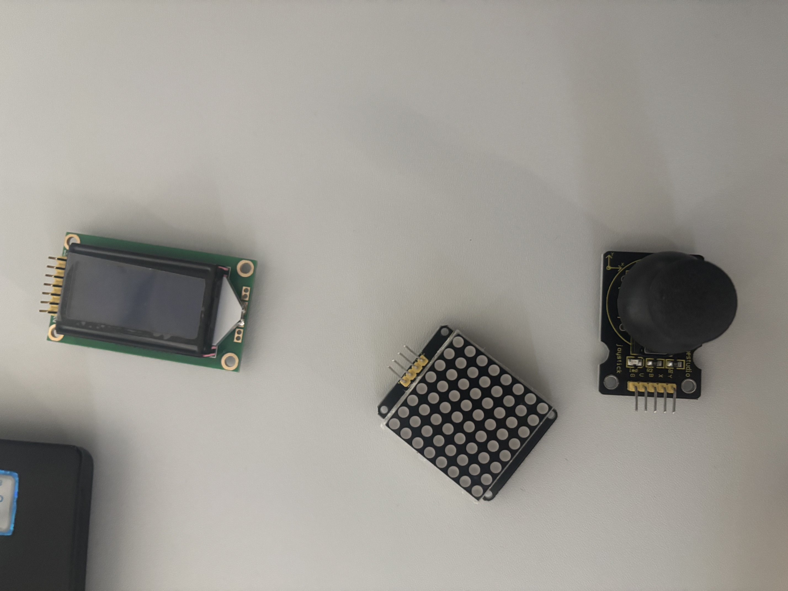

Portfolio Sensoren und Aktoren der Schule
=========================================

.. important::
   Sie haben Sich mit den Sensoren und Aktoren der Schule auseinander gesetzt (Eintrag was es für Sensoren und Aktoren in der Schule zum Ausleihen hat.)
   Eintrag in Portfolio. Inkl Foto, dass Sie sich damit beschäftigt haben.

Sensoren und Aktoren
--------------------

Bei einem IoT-System muss die physische Welt irgendwie mit der digitalen Welt verbunden werden. Dafür spielen **Sensoren und Aktoren** eine wichtige Rolle.

Ein **Sensor** erfasst eine physikalische Grösse oder einen Zustand aus seiner Umgebung und wandelt diesen in einen Wert um, der von einem digitalen System verarbeitet werden kann. Beispiele dafür sind Temperatur, Luftfeuchtigkeit, Helligkeit, Bewegung oder Abstand.

Ein **Aktor** funktioniert in die andere Richtung. Er erhält ein elektrisches Signal und erzeugt daraus eine physische Aktion, beispielsweise Licht, Bewegung oder Schall.

Vereinfacht kann ich mir den Unterschied so merken:

``Sensor: reale Welt → Daten``

``Aktor: Daten / Signal → reale Welt``

.. note::
   Im Unterricht wurde dazu der Vergleich mit dem Menschen verwendet. **Augen und Ohren** funktionieren ähnlich wie Sensoren, weil sie Informationen aus unserer Umgebung aufnehmen. **Muskeln oder der Mund beim Sprechen** entsprechen eher Aktoren, weil damit eine Aktion ausgeführt wird.

Sensoren und Aktoren der Schule
-------------------------------

In der Schule steht eine grössere Sammlung unterschiedlicher Sensoren, Aktoren und weiterer Module zum Ausleihen zur Verfügung. Je nach Projekt können damit unterschiedliche Informationen erfasst oder Aktionen und Ausgaben realisiert werden.

Auf der Übersicht der Schule habe ich unter anderem folgende Komponenten gesehen:

.. list-table::
   :header-rows: 1
   :widths: 35 65

   * - Komponente
     - Aufgabe / Verwendung
   * - ``DHT11``
     - Erfasst Temperatur und Luftfeuchtigkeit.
   * - ``APDS-9930``
     - Erfasst unter anderem Umgebungslicht beziehungsweise Annäherung.
   * - Tilt Sensor
     - Kann eine Neigung beziehungsweise Lageänderung erkennen.
   * - Joystick-Modul
     - Erfasst die Bewegung beziehungsweise Position eines Joysticks.
   * - Rotary Encoder
     - Erfasst Drehbewegungen und kann beispielsweise zur Bedienung verwendet werden.
   * - Servo-Motor
     - Führt eine mechanische Bewegung beziehungsweise Positionierung aus.
   * - ``I2C 8×8 LED Dot Matrix``
     - Kann Informationen mit einzelnen LEDs darstellen.
   * - ``0802 LCD Module``
     - Kann kurze Texte, Zahlen oder Messwerte anzeigen.

Damit stehen nicht nur Sensoren zur Verfügung. Mit Servos, LEDs, Displays und weiteren Ausgabemodulen können Daten auch wieder in eine sichtbare oder physische Ausgabe umgesetzt werden.

Meine Auswahl aus der Sammlung
------------------------------

Nachdem ich mir einen Überblick über die vorhandenen Komponenten verschafft hatte, habe ich drei davon selbst aus der Sammlung genommen und genauer angeschaut.

   **Meine Auswahl aus der IoT-Sammlung:** Ein Joystick-Modul, eine ``I2C 8×8 LED Dot Matrix`` und ein ``0802 LCD Module``.

Bei meiner Auswahl fand ich interessant, dass die drei Module unterschiedliche Aufgaben übernehmen. Der Joystick dient als **Eingabe**, während die LED-Matrix und das LCD Informationen wieder **sichtbar ausgeben** können.

Joystick-Modul
~~~~~~~~~~~~~~

Als Eingabekomponente habe ich mir ein **Joystick-Modul** angeschaut. Durch das Bewegen des Joysticks wird eine physische Eingabe in elektrische Werte umgesetzt, die anschliessend von einem Mikrocontroller verarbeitet werden können.

``Joystick bewegen → Position erfassen → Mikrocontroller → Aktion``

Damit könnte beispielsweise ein Servo gesteuert, durch ein Menü navigiert oder die Richtung eines anderen Gerätes bestimmt werden.

.. list-table::
   :widths: 45 55

   * - .. figure:: ../../../_static/img/sem4/iot/iot_schule-katalog-joystick.jpeg
          :alt: Joystick-Modul in der Übersicht der ausleihbaren Sensoren und Aktoren der Schule
          :align: center
          :width: 90%

          **Übersicht:** Das Joystick-Modul in der Sammlung der Schule.

     - .. figure:: ../../../_static/img/sem4/iot/iot_schule-joystick-modul.jpeg
          :alt: Von mir untersuchtes Joystick-Modul aus der IoT-Sammlung der Schule
          :align: center
          :width: 90%

          **Praxis:** Das Joystick-Modul, das ich mir selbst genauer angeschaut habe.

I2C 8×8 LED Dot Matrix
~~~~~~~~~~~~~~~~~~~~~~

Als Ausgabekomponente habe ich mir eine **I2C 8×8 LED Dot Matrix** angeschaut. Sie besteht aus **8 × 8 und damit 64 einzelnen LEDs**. Durch das gezielte Ansteuern der LEDs können beispielsweise Zahlen, Buchstaben, Symbole oder einfache Animationen dargestellt werden.

``Daten → Mikrocontroller → LED-Matrix → sichtbare Ausgabe``

.. list-table::
   :widths: 50 50

   * - .. figure:: ../../../_static/img/sem4/iot/iot_schule-katalog-led-dot-matrix.jpeg
          :alt: I2C 8x8 LED Dot Matrix in der Übersicht der ausleihbaren Module der Schule
          :align: center
          :width: 90%

          **Übersicht:** Die ``I2C 8×8 LED Dot Matrix`` aus der Sammlung der Schule.

     - .. figure:: ../../../_static/img/sem4/iot/iot_schule-led-dot-matrix-vorderseite.jpeg
          :alt: Vorderseite der von mir untersuchten I2C 8x8 LED Dot Matrix mit 64 LEDs
          :align: center
          :width: 90%

          **Praxis:** Die Vorderseite des Moduls mit den 64 einzelnen LED-Punkten.

Auf dem Modul sind unter anderem die Anschlüsse ``SCL`` und ``SDA`` vorhanden. Diese gehören zur ``I2C``-Kommunikation. Die Matrix kann dadurch als vollständiges Modul von einem Mikrocontroller angesteuert werden.

In einem IoT-Projekt könnte damit beispielsweise ein Zustand direkt am Gerät durch ein Symbol oder eine Zahl angezeigt werden.

0802 LCD Module
~~~~~~~~~~~~~~~

Als dritte Komponente habe ich mir ein ``0802 LCD Module`` angeschaut. Auch dieses Modul dient als **Ausgabe**, stellt Informationen aber anders dar als die LED-Matrix.

Die Bezeichnung ``0802`` beschreibt den Aufbau des Displays: Es können **2 Zeilen mit jeweils 8 Zeichen** dargestellt werden. Dadurch eignet es sich für kurze Texte, Zahlen, Messwerte oder Statusinformationen.

``Sensor → Mikrocontroller → LCD → Messwert anzeigen``

Ein Temperatursensor könnte beispielsweise einen Messwert liefern und ein ``ESP32`` diesen anschliessend direkt auf dem Display anzeigen.

.. list-table::
   :widths: 45 55

   * - .. figure:: ../../../_static/img/sem4/iot/iot_schule-katalog-0802-lcd-module.jpeg
          :alt: 0802 LCD Module in der Übersicht der ausleihbaren Module der Schule
          :align: center
          :width: 90%

          **Übersicht:** Das ``0802 LCD Module`` in der Sammlung der Schule.

     - .. figure:: ../../../_static/img/sem4/iot/iot_schule-0802-lcd-module.jpeg
          :alt: Von mir untersuchtes 0802 LCD Module aus der IoT-Sammlung der Schule
          :align: center
          :width: 90%

          **Praxis:** Das ``0802 LCD Module``, das ich mir selbst genauer angeschaut habe.

Im Vergleich zur ``I2C 8×8 LED Dot Matrix`` eignet sich das LCD besser für konkrete **Zahlen oder kurze Texte**. Die LED-Matrix eignet sich dagegen besser für einfache Symbole, Muster oder kleine Animationen.

Was ich daraus mitnehme
-----------------------

Durch das direkte Anschauen der Komponenten ist für mich der Unterschied zwischen **Eingabe und Ausgabe** beziehungsweise **Sensoren und Aktoren** anschaulicher geworden.

Bei meinen drei ausgewählten Modulen konnte ich unterschiedliche Aufgaben nachvollziehen: Beim **Joystick** wird eine physische Bewegung zu einem Wert, den ein Mikrocontroller verarbeiten kann. Das ``0802 LCD Module`` kann konkrete Zahlen oder kurze Texte darstellen, während die ``I2C 8×8 LED Dot Matrix`` Informationen beispielsweise über Punkte oder Symbole sichtbar machen kann.

Für mich zeigt die Sammlung der Schule gut, wie sich aus verschiedenen Bausteinen später ein vollständiges System zusammensetzen lässt:

``Sensor / Eingabe → Verarbeitung → Aktor / Ausgabe``