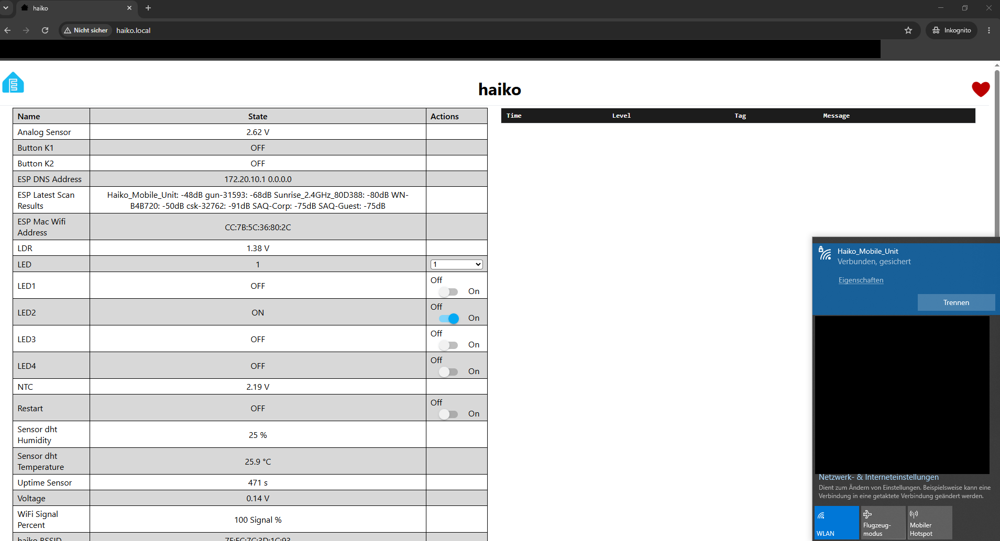

Screenshot ESP Webserver
========================

.. important::
   Sie haben ein erstes Programm auf dem ESP zum laufen gekriegt und sich via Web auf die Oberfläche verbunden.

Voraussetzungen
---------------

Bevor ich mit dem eigentlichen ESPHome-Projekt beginnen konnte, musste ich
zuerst die benötigte Software für die Entwicklung und die Kommunikation mit
dem ESP32 einrichten.

Für meinen Aufbau benötige ich:

.. list-table::
   :header-rows: 1
   :widths: 30 70

   * - Voraussetzung
     - Verwendung
   * - ``Python``
     - Wird benötigt, um ESPHome auf meinem Computer zu installieren und
       auszuführen.
   * - ``ESPHome``
     - Erstellt aus den YAML-Konfigurationen die Firmware, die anschliessend
       auf den ESP32 übertragen wird.
   * - ``CP210x``-USB-Treiber
     - Ermöglicht unter Windows die Kommunikation zwischen meinem Computer
       und dem ESP32 über USB.
   * - USB-Kabel
     - Wird insbesondere beim ersten Übertragen der ESPHome-Firmware auf den
       ESP32 benötigt.
   * - WLAN
     - Wird benötigt, damit der ESP32 nach dem ersten Flashen über das
       Netzwerk erreichbar ist. Dafür habe ich den Hotspot meines iPhones
       verwendet.

Python und ESPHome
~~~~~~~~~~~~~~~~~~

Zuerst muss ``Python`` auf dem Computer installiert sein. Bei der
Python-Installation ist wichtig, dass **Add Python to PATH** aktiviert ist.
Dadurch kann Python anschliessend direkt über das Terminal verwendet werden.

ESPHome kann danach mit ``pip`` installiert werden:

.. code-block:: powershell

   pip3 install esphome

Damit steht der Befehl ``esphome`` im Terminal zur Verfügung und die
YAML-Konfigurationen können kompiliert werden.

Installation überprüfen
~~~~~~~~~~~~~~~~~~~~~~~~

Nach der Installation habe ich im PowerShell-Terminal überprüft, ob ``Python``,
``pip`` und ``ESPHome`` korrekt installiert und über die Kommandozeile
erreichbar sind.

Dazu habe ich die folgenden Befehle ausgeführt:

.. code-block:: powershell

   python --version
   pip --version
   esphome version

Auf meinem System erhalte ich aktuell folgende Ausgabe:

.. code-block:: text

   PS C:\Users\Student> python --version
   Python 3.14.0

   PS C:\Users\Student> pip --version
   pip 25.2 from C:\Users\Student\AppData\Local\Programs\Python\Python314\Lib\site-packages\pip (python 3.14)

   PS C:\Users\Student> esphome version
   Version: 2026.7.4

Damit konnte ich überprüfen, dass die benötigten Programme installiert sind
und direkt aus PowerShell gestartet werden können.

.. note::
   Besonders wichtig ist, dass der Befehl ``esphome version`` direkt
   funktioniert. Damit ist ESPHome installiert und über das Terminal
   erreichbar.

USB-Treiber für den ESP32
~~~~~~~~~~~~~~~~~~~~~~~~~

Für die erste Verbindung zwischen meinem Computer und dem ESP32 benötige ich
zusätzlich den ``CP210x``-USB-Treiber.

Der Treiber sorgt dafür, dass Windows die serielle USB-Verbindung des Boards
erkennt. Danach kann ESPHome die kompilierte Firmware über USB auf den ESP32
übertragen.

.. note::
   Der USB-Treiber ist vor allem für das erste Flashen wichtig. Sobald
   ESPHome auf dem ESP32 läuft und dieser mit dem WLAN verbunden ist, können
   spätere Änderungen auch über **OTA (Over-the-Air)** übertragen werden.

ESPHome-Projekt
---------------

Für die ersten praktischen Versuche mit ESPHome habe ich das bereitgestellte
Demo-Projekt verwendet. Das Projekt befindet sich bei mir unter:

.. code-block:: text

   C:\Users\Student\Desktop\workstation\demo

Das Projekt besteht aus einer zentralen ``main.yaml`` und mehreren weiteren
YAML-Dateien. Dadurch können die einzelnen Sensoren und Aktoren getrennt
konfiguriert und anschliessend in der Hauptkonfiguration eingebunden werden.

Projektstruktur
~~~~~~~~~~~~~~~

Meine aktuelle Projektstruktur sieht folgendermassen aus:

.. code-block:: text

   demo/
   ├── .esphome/                 # Von ESPHome erzeugte Build- und Arbeitsdaten
   ├── .gitignore
   ├── adc.yaml
   ├── bmp280.yaml
   ├── button.yaml
   ├── buzzer.yaml
   ├── dht.yaml                  # DHT-Sensor für Temperatur und Luftfeuchtigkeit
   ├── fastled.yaml
   ├── ir_remote_receiver.yaml
   ├── lcd_pcf8574.yaml
   ├── led.yaml                  # Konfiguration der LEDs
   ├── main.yaml                 # Zentrale Konfiguration des ESP32
   ├── secrets.yaml              # WLAN- und Webserver-Zugangsdaten
   ├── select.yaml
   ├── startup.yaml
   ├── tm1637.yaml
   └── wifi_signal.yaml          # Informationen zur WLAN-Verbindung

Nicht jede Datei ist für die ersten Schritte gleich wichtig. Einige Dateien
spielen für meine aktuelle Konfiguration jedoch bereits eine zentrale Rolle:

.. list-table::
   :header-rows: 1
   :widths: 25 75

   * - Datei / Ordner
     - Aufgabe
   * - ``.esphome/``
     - Dieser Ordner wird automatisch von ESPHome erstellt. Darin befinden
       sich interne Arbeits- und Build-Dateien, die unter anderem beim
       Kompilieren der Firmware benötigt werden.
   * - ``main.yaml``
     - Zentrale Konfigurationsdatei meines ESP32. Hier werden unter anderem
       das Board, WLAN, Webserver, OTA, Logger, I2C und die zusätzlichen
       YAML-Dateien konfiguriert.
   * - ``secrets.yaml``
     - Enthält Zugangsdaten wie WLAN-Passwort und Webserver-Zugangsdaten.
       Dadurch müssen diese nicht direkt in der ``main.yaml`` stehen.
   * - ``dht.yaml``
     - Konfiguration des DHT-Sensors für Temperatur und Luftfeuchtigkeit.
   * - ``led.yaml``
     - Enthält die Konfiguration der LEDs auf dem verwendeten Board.
   * - ``wifi_signal.yaml``
     - Stellt Informationen zur WLAN-Verbindung beziehungsweise zum
       WLAN-Signal bereit.

Die Aufteilung auf mehrere Dateien finde ich praktisch, da die
``main.yaml`` dadurch übersichtlicher bleibt und einzelne Funktionen
separat ein- oder ausgeschaltet werden können.

Meine main.yaml
---------------

Die zentrale Datei meines Projekts ist die ``main.yaml``. Mein aktueller
Stand sieht folgendermassen aus:

.. code-block:: yaml

   substitutions:
     name: haiko #My not be longer then 10 letters
     ssid: !secret ssid
     ssid_pass: !secret ssid_pass
     webserver_user: !secret webserver_user
     webserver_pass: !secret webserver_pass
     fallback_pass: !secret fallback_pass
     #static_ip: 10.130.1.21
     #gateway: 10.130.1.1
     #subnet: 255.255.255.0

   # Basic configuration for an ESP32 device
   esphome:
     name: ${name}
     friendly_name: ${name}

   # Hardware configuration
   esp32:
     board: esp32dev
     framework:
       type: arduino

   # Enable Home Assistant API
   api:

   # Enable over-the-air updates
   ota:
     platform: esphome

   wifi:
     ssid: ${ssid}
     password: ${ssid_pass}

     on_connect:
       then:
         - switch.turn_on:
             id: LED2
         - switch.turn_off:
             id: LED1

     on_disconnect:
       then:
         - switch.turn_on:
             id: LED1
         - switch.turn_off:
             id: LED2

     ap:
       ssid: ESPHome ${name}
       password: ${fallback_pass}

   captive_portal:

   # Enable logging
   logger:
     level: DEBUG
     #level: VERBOSE

   web_server:
     port: 80
     auth:
       username: ${webserver_user}
       password: ${webserver_pass}

   time:
     - platform: sntp
       id: sntp_time
       timezone: Europe/Zurich
       servers:
         - 0.pool.ntp.org
         - 1.pool.ntp.org
         - 2.pool.ntp.org

   # I2C Config
   i2c:
     #ESP8266
     #sda: 4
     #scl: 5
     #ESP32
     sda: 21
     scl: 22
     scan: True
     id: bus_a

   packages:
     # Include the remote receiver configuration
     #ir: !include ir_remote_receiver.yaml
     # Include the DHT sensor configuration
     dht: !include dht.yaml
     # Include the BMP280 sensor configuration
     #bmp280: !include bmp280.yaml
     # Include the ADC sensor configuration
     adc: !include adc.yaml
     # Include the TM1637 display configuration
     tm1637: !include tm1637.yaml
     # Include the WiFi signal sensor configuration
     wifi_signal: !include wifi_signal.yaml
     # Include the buzzers configuration
     rtttl: !include buzzer.yaml
     # Include the button configuration
     button: !include button.yaml
     # Include the LED configuration
     led: !include led.yaml
     # Include the select configuration
     select: !include select.yaml
     # Include the startup configuration
     startup: !include startup.yaml
     #Include the LCD Display configuration
     #lcd: !include lcd_pcf8574.yaml
     #Include the FastLED configuration
     #fastled: !include fastled.yaml

Über den Bereich ``packages`` werden die einzelnen Konfigurationsdateien
in die Hauptkonfiguration eingebunden. Funktionen, die ich momentan nicht
verwende, sind mit ``#`` auskommentiert.

Dadurch kann ich beispielsweise den DHT-Sensor und die LEDs verwenden,
ohne den gesamten dazugehörigen Code direkt in die ``main.yaml`` schreiben
zu müssen.

Zugangsdaten mit secrets.yaml
-----------------------------

Zugangsdaten werden nicht direkt in meiner ``main.yaml`` gespeichert.
Stattdessen werden sie mit ``!secret`` referenziert:

.. code-block:: yaml

   ssid: !secret ssid
   ssid_pass: !secret ssid_pass
   webserver_user: !secret webserver_user
   webserver_pass: !secret webserver_pass
   fallback_pass: !secret fallback_pass

Die eigentlichen Werte befinden sich in der Datei ``secrets.yaml``.

Das ist besonders für die Dokumentation praktisch, weil ich meinen
Programmcode zeigen kann, ohne dabei beispielsweise mein WLAN-Passwort
zu veröffentlichen.

Verbindung über meinen iPhone-Hotspot
-------------------------------------

Für die WLAN-Verbindung habe ich meinen iPhone-Hotspot verwendet. Die
SSID und das Passwort meines Hotspots habe ich in der ``secrets.yaml``
hinterlegt.

Beim iPhone musste ich zusätzlich die Option **Kompatibilität maximieren**
aktivieren, damit die Verbindung mit dem ESP funktioniert.

Der ESP32 verwendet anschliessend die in der ``main.yaml`` konfigurierte
WLAN-Verbindung:

.. code-block:: yaml

   wifi:
     ssid: ${ssid}
     password: ${ssid_pass}

     on_connect:
       then:
         - switch.turn_on:
             id: LED2
         - switch.turn_off:
             id: LED1

     on_disconnect:
       then:
         - switch.turn_on:
             id: LED1
         - switch.turn_off:
             id: LED2

Damit kann ich am Board zusätzlich erkennen, ob die WLAN-Verbindung
besteht. Bei einer erfolgreichen Verbindung wird ``LED2`` eingeschaltet
und ``LED1`` ausgeschaltet. Bei einem Verbindungsabbruch geschieht das
Umgekehrte.

Programm auf den ESP32 laden
----------------------------

Nachdem die Konfiguration vorbereitet war, konnte ich das ESPHome-Projekt
über das Terminal ausführen.

Dazu wechselte ich in meinen Projektordner:

.. code-block:: powershell

   PS C:\Users\Student\Desktop\workstation\demo>

Anschliessend wird die ``main.yaml`` mit ESPHome kompiliert und auf den
ESP32 übertragen:

.. code-block:: powershell

   esphome run .\main.yaml

Beim ersten Durchlauf kompiliert ESPHome die Konfiguration. Da sich zu
diesem Zeitpunkt noch keine über WLAN erreichbare ESPHome-Firmware auf dem
Board befindet, wird der ESP32 für das erste Übertragen über USB mit dem
Computer verbunden.

Der installierte ``CP210x``-Treiber ermöglicht dabei die serielle
Kommunikation mit dem Board.

In meiner Konfiguration ist zusätzlich OTA aktiviert:

.. code-block:: yaml

   ota:
     platform: esphome

Dadurch können spätere Änderungen auch **Over the Air (OTA)** über das
Netzwerk übertragen werden. Der ESP muss dafür nicht jedes Mal erneut über
USB angeschlossen werden.

Webserver auf dem ESP
---------------------

In meiner ``main.yaml`` ist zusätzlich der ESPHome-Webserver aktiviert:

.. code-block:: yaml

   web_server:
     port: 80
     auth:
       username: ${webserver_user}
       password: ${webserver_pass}

Der Webserver läuft auf Port ``80`` und ist mit Benutzername und Passwort
geschützt. Die Zugangsdaten werden wiederum aus der ``secrets.yaml``
übernommen.

Nachdem sich der ESP32 erfolgreich mit meinem Hotspot verbunden hatte,
konnte ich die Weboberfläche über den Hostnamen

.. code-block:: text

   haiko.local

im Browser aufrufen.

Erfolgreicher Zugriff auf die Weboberfläche
-------------------------------------------

Der Zugriff auf ``haiko.local`` funktioniert bei mir erfolgreich. Damit
ist ersichtlich, dass der ESP32 läuft, mit meinem WLAN verbunden ist und
der konfigurierte Webserver erreichbar ist.

   Meine ESPHome-Weboberfläche unter ``http://haiko.local/``

Auf der Weboberfläche sehe ich bereits verschiedene Werte und
Steuerungsmöglichkeiten meines Boards. Unter anderem werden bei meinem
aktuellen Stand folgende Informationen angezeigt:

* der analoge Sensorwert,
* der LDR-Wert,
* der NTC-Wert,
* Temperatur und Luftfeuchtigkeit des DHT-Sensors,
* die Laufzeit des ESP,
* verschiedene LEDs,
* Taster,
* WLAN-Informationen und
* Logmeldungen des ESP32.

Auf meinem Screenshot liefert der DHT-Sensor beispielsweise bereits
Temperatur- und Luftfeuchtigkeitswerte. Gleichzeitig lassen sich die
konfigurierten LEDs direkt über die Weboberfläche schalten.

Besonders hilfreich finde ich auch die Logausgabe auf der rechten Seite.
Dort kann ich direkt erkennen, was auf dem ESP passiert und ob
beispielsweise die WLAN-Verbindung funktioniert.

Erstes Fazit
------------

Mein bisheriger Weg bis zur funktionierenden Weboberfläche lässt sich damit
folgendermassen zusammenfassen:

.. code-block:: text

   Python installieren
          |
          v
   ESPHome installieren
          |
          v
   Installation überprüfen
          |
          v
   CP210x-Treiber installieren
          |
          v
   Demo-Projekt konfigurieren
          |
          v
   main.yaml + secrets.yaml
          |
          v
   Firmware kompilieren
          |
          v
   Erstes Flashen über USB
          |
          v
        ESP32
          |
          v
     iPhone-Hotspot
          |
          v
      haiko.local
          |
          v
   ESPHome-Weboberfläche

Die modulare Struktur mit mehreren YAML-Dateien finde ich dabei sinnvoll.
Die ``main.yaml`` bildet die zentrale Konfiguration, während einzelne
Sensoren und Aktoren in eigenen Dateien definiert werden können.

Der ESP32 verbindet sich inzwischen erfolgreich mit meinem iPhone-Hotspot
und ich kann über ``haiko.local`` auf seine Weboberfläche zugreifen.
Damit ist die grundlegende ESPHome-Konfiguration funktionsfähig.

Als nächster Schritt möchte ich nun gezielt ein eigenes erstes Programm
beziehungsweise eine eigene Funktion auf dem ESP umsetzen und testen.
Damit kann ich zusätzlich praktisch zeigen, dass ich nicht nur die
vorbereitete Weboberfläche erreichen, sondern auch eigene Logik auf dem
ESP ausführen kann.