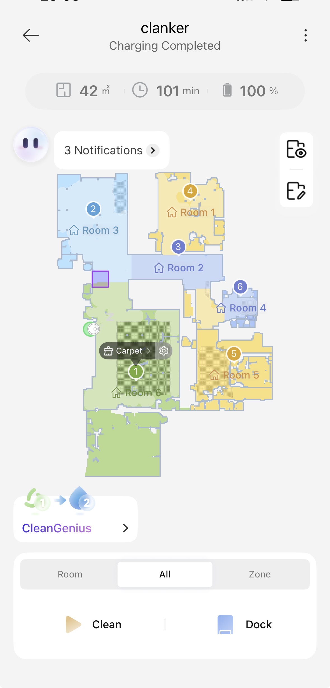

Was ist IoT
===========

.. important::
   Sie haben Sich mit dem Begriff IoT auseinander gesetzt und einen kurzen Eintrag dazu im Portfolio gemacht.
   Inkl Persönlicher Reflexion wo IoT in Ihrem Leben eine Rolle spielt.

Was bedeutet IoT?
-----------------

IoT steht für „Internet of Things“ und bedeutet auf Deutsch „Internet der Dinge“. Damit ist die Vernetzung von physischen Geräten, Sensoren und anderen Gegenständen über ein Netzwerk, häufig über das Internet, gemeint.

Ein IoT-Gerät kann Daten erfassen, diese über ein Netzwerk übertragen und je nach Anwendung auch auf die Daten reagieren. Dadurch können aus einem einzelnen Gerät zusätzliche Funktionen und Dienstleistungen entstehen. Ein Sensor kann beispielsweise Temperaturdaten erfassen. Werden diese Daten von einem Smart-Home-System verarbeitet, kann es abhängig von der Temperatur automatisch die Lüftung oder die Storen steuern.

IoT findet man heute in vielen verschiedenen Bereichen. Dazu gehören beispielsweise Smart-Home-Geräte, Wearables, vernetzte Fahrzeuge und industrielle Anlagen. Die Vernetzung ermöglicht es, Daten von verschiedenen Geräten zu sammeln, zu verarbeiten und daraus automatische Abläufe oder neue Dienstleistungen aufzubauen.

Ein wichtiger Aspekt von IoT ist deshalb nicht nur, dass ein Gerät mit dem Internet verbunden ist. Entscheidend ist, was durch die Verbindung und die Verarbeitung der Daten zusätzlich ermöglicht wird. Aus Sensoren, Aktoren und Software können dadurch ganze Systeme entstehen, die selbstständig auf bestimmte Situationen reagieren.

IoT in meinem Alltag
--------------------

Ein konkretes Beispiel für IoT in meinem Alltag ist mein smarter Roboterstaubsauger von Dreame. Der Roboter kann meine Wohnung saugen und den Boden wischen. Über die App konnte ich bereits meine gesamte Wohnung kartieren und die einzelnen Räume verwalten.

Der Roboter besitzt verschiedene Sensoren, mit denen er seine Umgebung erkennt. Dadurch kann er beispielsweise Teppiche erkennen und auf der erstellten Karte markieren. Im Smart-Modus kann er diese Informationen nutzen, um beim Wischen Teppiche auszulassen und dort stattdessen nur zu saugen.

Auch die Station des Roboters ist in das System integriert. Sie kann unter anderem den Staubbehälter des Roboters automatisch entleeren und beim Wischen das Wasser verwalten. Über die App bekomme ich Informationen darüber, wann beispielsweise die Wasserbehälter gewechselt oder der Staubbeutel der Station geleert werden muss.

Der Roboter kann mir ausserdem Benachrichtigungen auf mein Handy senden. Wenn er beispielsweise irgendwo stecken bleibt oder ein Problem feststellt, kann ich darüber informiert werden. Auch während eines normalen Reinigungsvorgangs kann er mir über Notifications mitteilen, dass er beispielsweise mit dem Staubsaugen fertig ist und nun mit dem Wischen beginnt. Dadurch bekomme ich Informationen über den aktuellen Zustand und den Fortschritt, ohne den Roboter selbst kontrollieren zu müssen.

Eine für mich eher lustige Funktion ist die Remote Control. Über mein Handy kann ich den Roboter direkt fernsteuern und ihn beispielsweise manuell durch die Wohnung fahren lassen. Dadurch kann ich nicht nur seine automatischen Funktionen nutzen, sondern auch direkt mit ihm interagieren.

Ich kann über die App ausserdem verfolgen, wo sich der Roboter befindet, wie lange er bereits arbeitet und welche Bereiche er gereinigt hat. Zusätzlich lassen sich automatische Abläufe definieren. Dadurch entsteht aus einem einfachen Staubsauger nicht nur ein Gerät, sondern ein vernetzter Dienst, der verschiedene Aufgaben selbstständig übernimmt.

   Dreame-App meines Roboterstaubsaugers mit der erstellten Karte meiner Wohnung und dem aktuellen Reinigungsstatus.

Persönliche Reflexion
---------------------

Vor dem IoT-Modul war mir bereits bewusst, dass es bei IoT um die Vernetzung von Geräten über das Internet oder ähnliche Netzwerke geht. Mir war auch bereits klar, dass durch die Verarbeitung der gesammelten Daten zusätzliche Funktionen und Dienstleistungen entstehen können.

Durch das Modul wurde mir aber nochmals bewusster, wie viel Potenzial in einer ursprünglichen IoT-Idee stecken kann. Mein Roboterstaubsauger ist für mich ein gutes Beispiel dafür. Die ersten Roboterstaubsauger waren im Vergleich zu heutigen Modellen noch relativ primitiv. Die Grundidee, dass ein Roboter selbstständig den Boden reinigt, war aber bereits vorhanden.

Über die Zeit wurde dieses Konzept immer weiterentwickelt. Probleme und Einschränkungen früherer Modelle wurden nach und nach gelöst und neue Funktionen ergänzt. Heute kann mein Roboter beispielsweise die Wohnung kartieren, Teppiche erkennen, saugen und wischen und sich danach selbstständig an seiner Station entleeren. Die Station kümmert sich zusätzlich um Wasser und die Reinigung der Mopps. Über die App kann ich das gesamte System überwachen und steuern.

Genau diese Entwicklung finde ich interessant. Aus einer relativ einfachen Grundidee ist über mehrere Generationen ein umfangreiches System mit vielen zusätzlichen Dienstleistungen entstanden. In diesem Zusammenhang gefällt mir auch die im Modul erwähnte Philosophie „Fail fast, learn fast“. Eine erste Lösung muss noch nicht perfekt sein. Man kann Erfahrungen damit sammeln, Probleme erkennen und die Idee immer weiter verbessern. Mein heutiger Roboter zeigt für mich sehr gut, was aus einer solchen kontinuierlichen Weiterentwicklung entstehen kann.